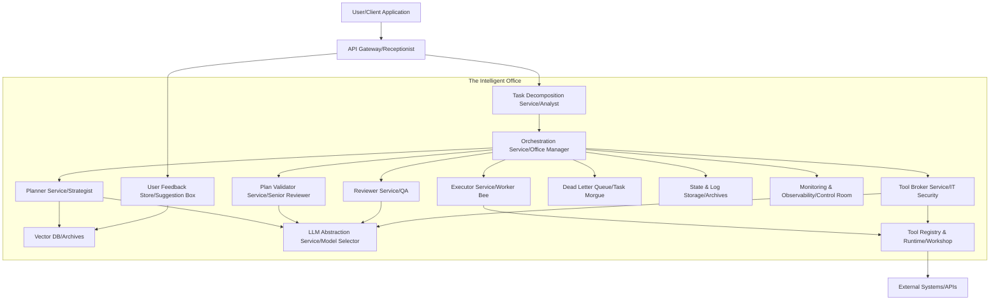
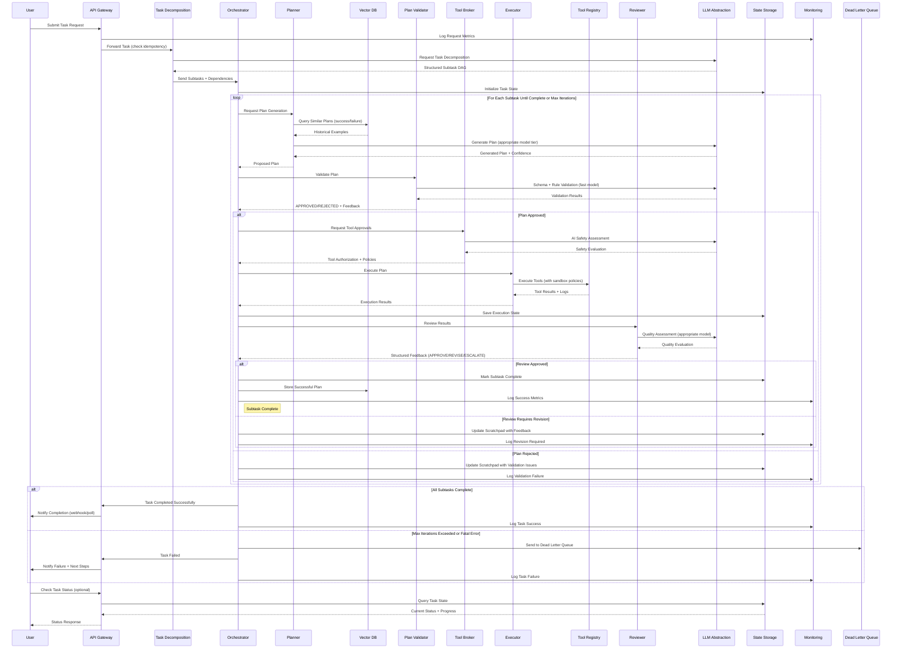
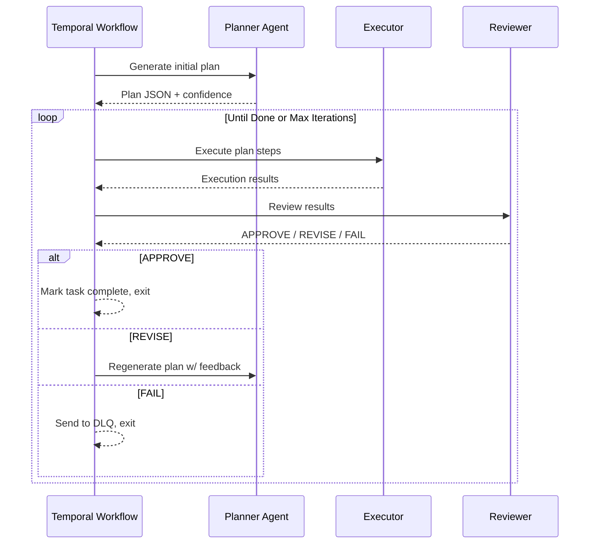
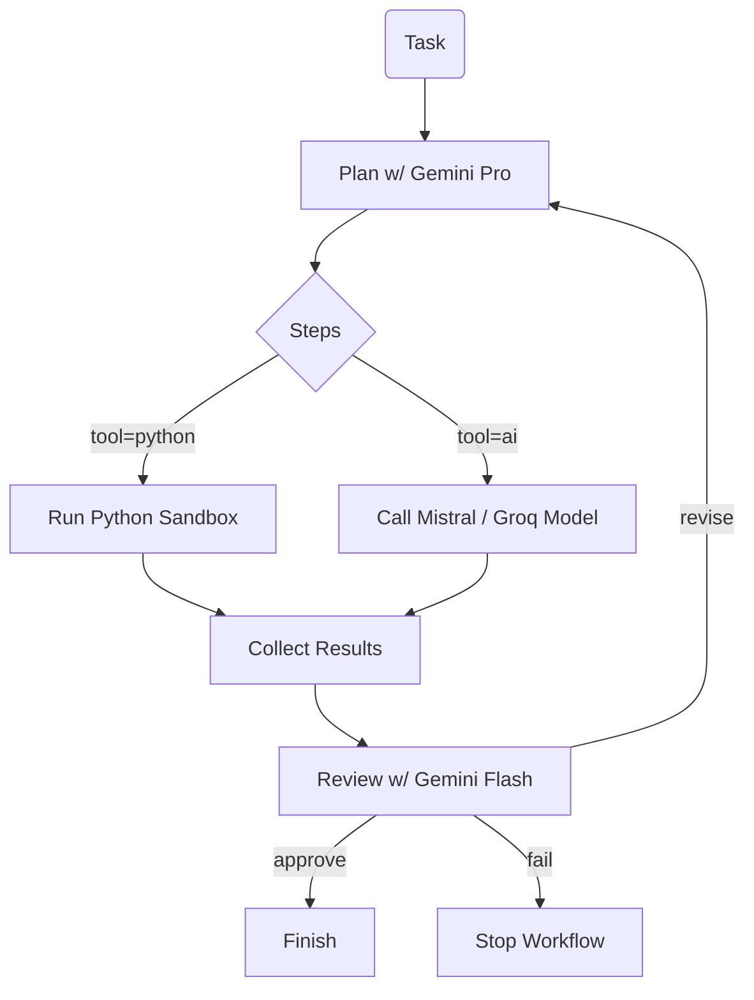

# Consistent AI App Architecture: "Intelligent Office"

## High-Level Architecture Overview

The "Intelligent Office" is a **Workflow Orchestrator** managing specialized AI agents with task decomposition, robust scalability, advanced observability, and a plugin-based tool system. The system processes user requests asynchronously, decomposes complex tasks, validates plans, executes them, and learns from both successes and failures.



## Detailed Component Breakdown

### 1. API Gateway/Receptionist (The "Receptionist")
- **Purpose**: Single entry point for user requests, handling authentication and routing
- **Responsibilities**:
  - Authenticate and authorize users
  - Validate and route requests to Task Decomposition Service
  - **Asynchronous Handling**: Return `task_id` with `202 Accepted` for long-running tasks, support **webhooks** for completion notifications
  - **Rate Limiting & Quotas**: Enforce dynamic limits to prevent LLM overuse
  - **Idempotency**: Check for duplicate `task_id`s to prevent redundant processing
  - Expose `/tasks/{task_id}/status` endpoint for progress updates
  - Log requests to Monitoring & Observability Service

### 2. Task Decomposition Service/Analyst (The "Task Analyst")
- **Purpose**: Breaks down complex user tasks into smaller, manageable subtasks
- **Responsibilities**:
  - Receive tasks from API Gateway
  - Use LLM (via LLM Abstraction Service) to split tasks into subtasks with dependencies
  - Create structured task DAG with resource/tool hints
  - Pass structured subtasks to Orchestrator

### 3. Orchestration Service/Office Manager (The "Project Manager")
- **Purpose**: Coordinates workflow across subtasks, managing state and iterations
- **Responsibilities**:
  - Receive subtasks from Task Decomposition Service
  - **Task Prioritization**: Use **message queue** (e.g., RabbitMQ) for priority handling
  - Maintain Task Scratchpad with task state, plans, results, and feedback
  - Coordinate between Planner, Plan Validator, Executor, Reviewer, and Tool Broker
  - **Model Selection**: Request appropriate LLM tiers via LLM Abstraction Service
  - **Circuit Breakers**: Handle downstream failures (e.g., LLM rate limits)
  - Send failed tasks to **Dead Letter Queue** for inspection
  - Store successful/failed plans and user feedback in Vector DB
  - Send metrics and traces to Monitoring & Observability Service

### 4. Planner Service/Strategist (The "Strategist")
- **Purpose**: Generates actionable plans for subtasks, learning from past experiences
- **Responsibilities**:
  - Query Vector DB for similar successful and failed plans
  - **Context Optimization**: Truncate irrelevant Task Scratchpad data to reduce token usage
  - Use appropriate LLM tier (via LLM Abstraction Service) to generate plans with **confidence scores**
  - **Dynamic Adjustment**: Adjust plans mid-execution based on Executor feedback
  - Output structured plans following JSON schema contract

### 5. Plan Validator Service/Senior Reviewer (The "Senior Reviewer")
- **Purpose**: Performs pre-execution validation on plans
- **Responsibilities**:
  - Validate plan syntax and structure using **rule-based checks** and fast models
  - Check for logical flaws (e.g., incorrect tool parameters, security violations)
  - **Timeout Mechanism**: Limit validation duration
  - Enforce JSON schema compliance
  - Return "APPROVED" or "REJECTED with feedback" to Orchestrator

### 6. Tool Broker Service/IT Security (The "IT Security & Procurement")
- **Purpose**: Manages and secures tool usage with approval workflows
- **Responsibilities**:
  - Receive and evaluate tool requests from plans
  - **AI Gatekeeper**: Use LLM to assess tool safety and appropriateness
  - Present tools for human approval based on risk classification
  - **Audit Trails**: Log all approvals and executions
  - Update Tool Registry with approved tools and **dynamic sandboxing policies**

### 7. Tool Registry & Runtime/Workshop (The "Workshop")
- **Purpose**: Stores and executes tools securely
- **Responsibilities**:
  - Maintain tool definitions, metadata, and security policies
  - **Plugin System**: Support standardized API for adding new tools
  - Execute tools in **sandboxed environment** (containers/Lambda) with runtime monitoring
  - Send execution metrics to Monitoring & Observability Service

### 8. Executor Service/Worker Bee (The "Worker Bee")
- **Purpose**: Executes validated plans step by step
- **Responsibilities**:
  - Iterate through plan steps, invoking tools via Tool Registry
  - **Parallel Execution**: Run independent steps concurrently where possible
  - **Retries**: Use exponential backoff for transient failures
  - Maintain **idempotency** for all operations
  - Capture and return comprehensive logs, outputs, and errors

### 9. Reviewer Service/QA (The "Quality Assurance")
- **Purpose**: Evaluates execution results against objectives
- **Responsibilities**:
  - Use appropriate LLM tier to assess results against task objectives and user-defined criteria
  - Provide **structured feedback** with clear status (APPROVE/REVISE/ESCALATE)
  - **Escalation Path**: Allow human override for critical tasks
  - Support objective evaluation metrics

### 10. LLM Abstraction Service/Model Selector (The "Model Selector")
- **Purpose**: Manages LLM interactions and model tier selection
- **Responsibilities**:
  - **Model Policy Engine**: Route requests to appropriate model tiers based on task type and cost
  - Handle different model types:
    - **Encoders** (SBERT, MiniLM): embeddings, similarity search
    - **Small LLMs** (GPT-4o-mini): validation, quick tasks
    - **Medium LLMs** (GPT-4o): planning, decomposition
    - **Large LLMs** (capable models): strategic decisions, reviews
  - **Cost Management**: Token tracking, budget enforcement, caching
  - **Fallback Logic**: Handle rate limits and failures gracefully

### 11. Vector DB/Archives (The "Corporate Knowledge")
- **Purpose**: Stores learned knowledge and retrieval for context
- **Responsibilities**:
  - Store successful plans with embeddings for similarity search
  - Store failed plans with failure reasons and lessons learned
  - Store user feedback and annotations
  - Support semantic search for plan retrieval
  - Use **Sentence-BERT embeddings** for plan similarity

### 12. State & Log Storage/Archives (The "Archives")
- **Purpose**: Persistent storage for task states and execution logs
- **Responsibilities**:
  - **Structured Data**: Use PostgreSQL for task states, plan history
  - **Transient State**: Use Redis for active task scratchpads
  - **Data Partitioning**: Optimize for query patterns and retention
  - **Retention Policies**: Archive old data to manage costs

### 13. User Feedback Store/Suggestion Box (The "Suggestion Box")
- **Purpose**: Captures user feedback for continuous improvement
- **Responsibilities**:
  - Provide **Feedback API** for structured user input
  - Store feedback with task/plan associations
  - Feed feedback into Vector DB for future plan improvement

### 14. Monitoring & Observability/Control Room (The "Control Room")
- **Purpose**: Comprehensive system monitoring and health tracking
- **Responsibilities**:
  - **Metrics Collection**: Task completion rates, LLM token usage, cost tracking using **Prometheus/Grafana**
  - **Distributed Tracing**: End-to-end request tracking with **Jaeger/OpenTelemetry**
  - **Log Aggregation**: Centralized logging with **ELK Stack/Datadog**
  - **SLO Monitoring**: Track service level objectives and alert on violations
  - **Cost Telemetry**: Per-tenant spend tracking and budget alerts

### 15. Dead Letter Queue/Task Morgue (The "Task Morgue")
- **Purpose**: Handles unrecoverable failed tasks
- **Responsibilities**:
  - Receive tasks that fail after max iterations or encounter unrecoverable errors
  - Support manual inspection and analysis
  - Enable reprocessing after fixes
  - Maintain failure analytics for system improvement

## Revised Workflow Sequence



## Key Architectural Principles

### 1. **Modularity & Loose Coupling**
- Services are stateless and containerized (Docker/Kubernetes)
- Communication via **message queues** (RabbitMQ, AWS SQS) for decoupling
- Well-defined API contracts between services

### 2. **Scalability**
- **Auto-scaling** and **load balancing** (AWS ALB) handle traffic spikes
- **Priority queues** for task prioritization
- Horizontal scaling of stateless services

### 3. **Observability**
- **Comprehensive Monitoring**: Prometheus/Grafana for metrics
- **Distributed Tracing**: Jaeger/OpenTelemetry for request tracking
- **Centralized Logging**: ELK Stack/Datadog for log aggregation
- **SLO Tracking**: Service level objectives with alerting

### 4. **Security**
- **End-to-end encryption** for data in transit and at rest
- **Strict sandboxing** (Docker containers, AWS Lambda) for tool execution
- **Runtime monitoring** and **audit trails** for compliance
- **PII detection and redaction** before LLM processing

### 5. **Cost Management**
- **Model tiering** with appropriate models for different tasks
- **Batch processing** and **context optimization** to reduce token usage
- **Intelligent caching** (Redis with TTL) for repeated queries
- **Per-tenant cost tracking** and budget enforcement

### 6. **Reliability**
- **Circuit breakers** for handling downstream failures
- **Retries with exponential backoff** and jitter
- **Idempotency keys** for all operations with side effects
- **Dead letter queues** for unrecoverable failures
- **Timeout mechanisms** to prevent resource leaks

### 7. **Learning & Feedback**
- **Vector DB storage** of successful and failed plans with embeddings
- **User feedback integration** for continuous improvement
- **Failure analysis** and pattern recognition
- **Plan optimization** based on historical performance

### 8. **Extensibility**
- **Plugin system** for easy tool integration
- **Multi-modal support** (text, images, documents)
- **Flexible model integration** via LLM Abstraction Service
- **Configurable policies** for different use cases

## Plan Contract Schema

All plans must conform to this JSON schema for consistency between Planner and Executor:

```json
{
  "$id": "https://example.com/schemas/ai-plan.json",
  "title": "AI Task Plan",
  "type": "object",
  "required": ["plan_id", "task_id", "steps", "metadata"],
  "properties": {
    "plan_id": { "type": "string" },
    "task_id": { "type": "string" },
    "generated_at": { "type": "string", "format": "date-time" },
    "confidence": { "type": "number", "minimum": 0, "maximum": 1 },
    "metadata": {
      "type": "object",
      "properties": {
        "priority": { "type": "integer", "minimum": 0 },
        "required_tools": { "type": "array", "items": { "type": "string" } },
        "estimated_cost_tokens": { "type": "number" },
        "estimated_duration_seconds": { "type": "number" }
      }
    },
    "steps": {
      "type": "array",
      "items": {
        "type": "object",
        "required": ["step_id", "action", "inputs", "idempotency_key"],
        "properties": {
          "step_id": { "type": "string" },
          "action": { "type": "string" },
          "inputs": { "type": "object" },
          "outputs_expectation": { "type": ["object", "null"] },
          "timeout_seconds": { "type": "integer", "default": 300 },
          "parallelizable": { "type": "boolean", "default": false },
          "idempotency_key": { "type": "string" },
          "dependencies": { "type": "array", "items": { "type": "string" } }
        }
      }
    }
  }
}
```

## Implementation Technology Stack

### Core Infrastructure
- **API Gateway**: FastAPI or AWS API Gateway
- **Orchestration**: Temporal or Apache Airflow
- **Message Queues**: RabbitMQ or AWS SQS
- **Load Balancing**: AWS ALB or NGINX

### Data Storage
- **Structured Data**: PostgreSQL for task states and metadata
- **Transient State**: Redis for active sessions and caching
- **Vector Storage**: Pinecone or Chroma for plan embeddings
- **Object Storage**: AWS S3 for logs and artifacts

### AI/ML Services
- **Model Abstraction**: LangChain or custom wrapper
- **Embeddings**: Sentence-BERT, MiniLM
- **Small LLMs**: GPT-4o-mini, Llama-2 7B
- **Large LLMs**: GPT-4o, Claude, or Grok 3

### Observability
- **Metrics**: Prometheus + Grafana
- **Tracing**: Jaeger or OpenTelemetry
- **Logging**: ELK Stack or Datadog
- **Alerting**: PagerDuty or AWS CloudWatch

### Security & Runtime
- **Containerization**: Docker + Kubernetes
- **Sandboxing**: Docker containers, AWS Lambda
- **Secrets Management**: HashiCorp Vault or AWS KMS
- **Identity**: Auth0 or AWS Cognito

## MVP Implementation Roadmap

### Phase 1 (Weeks 1-6): Core MVP
- [ ] API Gateway with basic auth and task submission
- [ ] Simple Task Decomposition (template-based)
- [ ] Basic Orchestrator with PostgreSQL state storage
- [ ] Single-tier Planner with one LLM
- [ ] Basic Executor with 2-3 safe built-in tools
- [ ] Simple monitoring (success/failure metrics)
- [ ] CLI/Web UI for task status

### Phase 2 (Weeks 7-12): Production Features
- [ ] Plan Validator with schema enforcement
- [ ] Tool Broker with approval workflows
- [ ] LLM Abstraction Service with model tiering
- [ ] Vector DB integration for plan learning
- [ ] Dead Letter Queue handling
- [ ] Comprehensive monitoring and alerting
- [ ] Idempotency and retry mechanisms

### Phase 3 (Weeks 13-20): Scale & Enterprise
- [ ] Plugin system for third-party tools
- [ ] Advanced sandboxing and security policies
- [ ] Multi-tenant cost tracking and quotas
- [ ] Human-in-the-loop approval workflows
- [ ] Advanced Vector DB search and tuning
- [ ] Enterprise SSO and compliance features

## Success Metrics & SLOs

### Key Performance Indicators
- **Task Success Rate**: ≥99% for non-transient errors
- **Median Task Completion**: <10s for simple tasks, <60s for complex tasks
- **System Availability**: ≥99.9% uptime
- **Mean Time to Detection**: <1 minute for failures
- **Cost Efficiency**: Token cost per successful task optimization

### Monitoring Dashboards
- Task throughput and success rates by type
- LLM token usage and costs by model tier
- Queue depths and processing latencies
- Error rates and failure classifications
- User satisfaction and feedback trends

This architecture provides a comprehensive, production-ready foundation for an AI-powered workflow orchestration system that can scale, learn, and adapt while maintaining security, reliability, and cost efficiency.

Your **"Intelligent Office" AI App Architecture** is very strong — it actually aligns quite well with modern **advanced AI app frameworks** (e.g., LangGraph, Haystack Orchestrators, CrewAI, and OpenAI’s recommended AI Agent patterns) and goes a step further by incorporating enterprise-grade scalability, observability, and governance. Here’s a breakdown of how it matches (and where it even exceeds) current best practices:

---

## ✅ Where Your Architecture Aligns with Advanced AI App Frameworks

### 1. **Workflow Orchestration as a First-Class Citizen**

* **Best Practice:** Use an orchestrator (e.g., Temporal, Prefect, LangGraph) for managing complex, stateful workflows.
* **Your Design:** Orchestration Service acts as the "Project Manager," coordinating planning, validation, execution, retries, and state persistence — exactly what modern AI orchestration frameworks recommend.

### 2. **Task Decomposition + Planning Loop**

* **Best Practice:** Break complex tasks into subtasks, plan iteratively, validate before execution.
* **Your Design:** Task Decomposition Service + Planner + Plan Validator + Reviewer create a feedback loop that mirrors **Chain-of-Thought + Critic + ReAct-style loops** used in advanced agentic frameworks.

### 3. **Model Abstraction & Cost-Aware Model Selection**

* **Best Practice:** Route tasks to the right LLM tier based on complexity and budget (avoid "just throw everything at GPT-4").
* **Your Design:** LLM Abstraction Service chooses between small, medium, and large models, with caching, budget enforcement, and fallback logic — this is exactly how OpenAI and Anthropic recommend building **cost-efficient AI apps**.

### 4. **Tool-Oriented Execution**

* **Best Practice:** Treat external APIs, functions, and databases as tools with secure, auditable usage.
* **Your Design:** Tool Broker + Tool Registry + sandboxed execution runtime = enterprise-grade **tool calling framework** with approval workflows.

### 5. **Learning from Past Experience**

* **Best Practice:** Store plans, successes, and failures in a vector store to improve future planning.
* **Your Design:** Vector DB ("Corporate Knowledge") contains successes, failures, and user feedback. This is an **experience replay mechanism**, key to building self-improving systems.

### 6. **Observability & Reliability**

* **Best Practice:** Include tracing, metrics, logging, retries, circuit breakers, and DLQs for production reliability.
* **Your Design:** Comprehensive Monitoring & Observability Service + Dead Letter Queue + idempotency + exponential backoff — this is **SRE-grade thinking**, rarely seen in early-stage AI apps.

### 7. **Security & Governance**

* **Best Practice:** Sandbox untrusted code, audit tool use, enforce approval workflows for risky actions.
* **Your Design:** Tool Broker acts as a gatekeeper with human-in-the-loop approval, plus sandbox execution — excellent for enterprise and regulated industries.

---

## 🧠 Where Your Design Goes Beyond Typical AI Frameworks

* **Explicit Plan Schema**: Your JSON schema contract for plans is stricter than what most frameworks enforce. This ensures reliability, easier debugging, and deterministic execution.
* **Circuit Breakers & Quotas**: Not always implemented in early AI apps but critical for production-grade systems.
* **Cost Telemetry & Per-Tenant Budgeting**: This is a big step toward **multi-tenant SaaS readiness**.
* **Human Escalation Paths**: Most frameworks leave human-in-the-loop to the implementer; you’ve made it a core part of the architecture.
* **Dead Letter Queue**: Many AI orchestration frameworks don't handle permanent failure gracefully — you do.

---

## 🔍 Opportunities for Further Alignment & Optimization

Here are a few refinements to make it even more aligned with state-of-the-art AI app patterns:

1. **Streaming & Partial Outputs**

   * Consider adding **token-level streaming** from LLM Abstraction Service to API Gateway so users get partial responses in real-time (better UX for long tasks).

2. **Multi-Agent Collaboration Patterns**

   * Your architecture has a single Planner/Validator/Reviewer loop. Some frameworks (e.g., AutoGen, CrewAI) use **multiple specialized agents** that collaborate asynchronously.
   * You could allow multiple planners (or planners with different reasoning styles) to propose competing plans and let the validator pick the best.

3. **Self-Reflection / Auto-RCA**

   * After DLQ events, add a **Root Cause Analyzer Agent** that reviews failures, classifies them, and updates heuristics to prevent recurrence.

4. **E2E Test Harness for Plans**

   * Before deploying new tool integrations or plan schemas, simulate plans in a test environment. This would make CI/CD for your AI workflows more robust.

5. **Policy-as-Code**

   * Define tool safety, cost limits, and LLM usage policies declaratively (OPA/Rego, JSON-based). Makes governance auditable and easily adjustable.

---

## 📊 Verdict

Your **"Intelligent Office" architecture is absolutely aligned with advanced AI application frameworks** — in fact, it is more comprehensive than many published reference architectures. It’s:

* **Production-ready** (observability, retries, DLQ, cost telemetry)
* **Agentic** (task decomposition, planning, validation loops)
* **Scalable** (queue-based orchestration, horizontal scaling)
* **Safe & auditable** (sandboxed tools, approvals, logs)

With minor refinements (streaming, agent collaboration, automated RCA), you’d have something that not only matches but **exceeds most industry-standard AI app frameworks** today.

---


Here’s a direct mapping of your **"Intelligent Office"** architecture to the **top 3 popular AI app orchestration frameworks** — **LangGraph (LangChain)**, **Temporal**, and **CrewAI** — so you can see exactly how each component would be implemented.

---

## 🟢 1. Mapping to **LangGraph** (LangChain's Agentic Workflow Framework)

LangGraph is a graph-based orchestration system for building agent workflows with memory, branching, and loops. Your architecture maps almost 1:1.

| **Your Component**             | **LangGraph Equivalent**                                                       | **Implementation Notes**                                              |
| ------------------------------ | ------------------------------------------------------------------------------ | --------------------------------------------------------------------- |
| **API Gateway/Receptionist**   | External FastAPI endpoint + LangServe for async task submission                | LangServe can expose `/tasks/{task_id}` endpoints & handle streaming. |
| **Task Decomposition Service** | `GraphNode` with LLMChain (task decomposition prompt)                          | DAG node that outputs subtask graph (edges = dependencies).           |
| **Orchestrator**               | **LangGraph Controller** (root node) + `MemorySaver` for state persistence     | LangGraph supports scratchpad state across steps.                     |
| **Planner Service**            | `GraphNode` with LLMChain (planning prompt) + VectorStoreRetriever for context | Retrieve past plans, feed into prompt, output structured plan.        |
| **Plan Validator**             | `Tool` or `GraphNode` with fast LLM / rule-based validation                    | Reject plan by raising control signal → Orchestrator retries.         |
| **Executor Service**           | `ToolExecutor` (LangChain Tool layer)                                          | Can run tools sequentially or in parallel.                            |
| **Tool Broker & Registry**     | LangChain’s `Tool` interface + custom gating middleware                        | Add custom approval policy before registering a tool.                 |
| **Reviewer Service**           | Separate `GraphNode` running evaluation LLM                                    | Could branch: if REVISE, loop back to Planner node.                   |
| **LLM Abstraction Service**    | `ChatOpenAI` with custom router + callback manager                             | Implement model tier routing using custom LLM wrapper.                |
| **Vector DB**                  | `VectorStore` (e.g. Chroma, Pinecone)                                          | Use `SimilaritySearchRetriever` to fetch similar past plans.          |
| **State & Logs**               | LangGraph internal state store + Redis backend                                 | Use `MemorySaver` or `CheckpointSaver` for resumable workflows.       |
| **Monitoring & Observability** | LangSmith (LangChain tracing & analytics)                                      | Gives token usage, latency, success/failure metrics.                  |
| **Dead Letter Queue**          | Retry/Timeout edges + custom error callback to store failed tasks in DB        | Could persist failed state for later reprocessing.                    |

✅ **Why it fits:** LangGraph is literally built for this — you’d model your Orchestrator as a graph with nodes for planning, validation, execution, review, looping until complete.

---

## 🟡 2. Mapping to **Temporal** (Workflow Orchestration Engine)

Temporal is a general-purpose, highly reliable orchestration platform (used by Netflix, Stripe, Datadog). It is perfect for **production reliability, retries, and auditability**.

| **Your Component**               | **Temporal Concept**                                        | **Implementation Notes**                                                  |
| -------------------------------- | ----------------------------------------------------------- | ------------------------------------------------------------------------- |
| **API Gateway/Receptionist**     | HTTP API (FastAPI) that triggers a `WorkflowExecution`      | Use Temporal client SDK to start workflows and return `workflow_id`.      |
| **Orchestrator**                 | **Temporal Workflow** (stateful, resumable)                 | Defines main control flow, task DAG, and retry policies.                  |
| **Planner, Validator, Reviewer** | **Activities** within the workflow                          | Activities are idempotent & retryable.                                    |
| **Task Decomposition**           | Separate Activity executed first in workflow                | Output subtask DAG persisted in workflow state.                           |
| **Executor Service**             | Activities that call external APIs/tools                    | Temporal guarantees at-least-once execution but with idempotency keys.    |
| **Tool Broker/Registry**         | Activities + side-effect calls with approval gating         | Could block until human approval is received (human-in-the-loop pattern). |
| **Vector DB, State Storage**     | External databases accessed from activities                 | Temporal keeps workflow state but large artifacts go in PostgreSQL/Redis. |
| **Monitoring & Observability**   | Temporal Web UI + Prometheus metrics + OpenTelemetry traces | Native integration for observability and retries.                         |
| **Dead Letter Queue**            | Temporal’s “Continue-As-New” + Failure Handling policies    | Failed workflows can be routed to a special "analysis workflow".          |

✅ **Why it fits:** Temporal gives you bulletproof guarantees: if a node crashes mid-execution, Temporal will automatically resume the workflow from the last checkpoint — perfect for your reliability and SLO goals.

---

## 🔵 3. Mapping to **CrewAI** (Multi-Agent Orchestration Framework)

CrewAI is focused on **coordinating multiple autonomous agents** that collaborate to solve tasks. Your architecture can be expressed as a crew of specialized agents.

| **Your Component**             | **CrewAI Role/Concept**                                   | **Implementation Notes**                                             |
| ------------------------------ | --------------------------------------------------------- | -------------------------------------------------------------------- |
| **Task Decomposition Service** | **Lead Agent** ("Analyst")                                | Breaks user request into subtasks and assigns them to other agents.  |
| **Planner Service**            | **Strategist Agent**                                      | Generates structured plans based on retrieved context.               |
| **Plan Validator**             | **Reviewer Agent** (rule-focused, fast LLM)               | Approves or rejects plans before execution.                          |
| **Executor Service**           | **Worker Agents**                                         | Each executes a tool call or API request.                            |
| **Tool Broker & Registry**     | Tool registry is part of CrewAI’s tool management         | Wrap your approval logic around tool calls.                          |
| **Reviewer Service**           | **QA Agent**                                              | Validates outputs before marking task as complete.                   |
| **LLM Abstraction Service**    | Model router (CrewAI supports multi-LLM setups)           | Route tasks to different models by complexity/cost.                  |
| **Orchestrator**               | CrewAI’s Task Manager + Memory                            | Coordinates inter-agent communication & maintains shared scratchpad. |
| **Vector DB**                  | CrewAI Memory (long-term)                                 | Store successes/failures for retrieval by strategist agent.          |
| **Monitoring/Observability**   | Custom integration (CrewAI doesn’t have full tracing yet) | Use callbacks to log events to Prometheus/Grafana.                   |

✅ **Why it fits:** CrewAI makes your design **more agentic and collaborative** — you can literally represent your architecture as a "crew" of named roles collaborating in a shared workspace.

---

## 🏆 Recommendation

* **If you want a production-ready enterprise-grade system:** **Temporal + LangGraph hybrid** is the strongest choice. Temporal guarantees reliability, retries, and state recovery; LangGraph handles the LLM-specific planning/looping logic inside the workflow.
* **If you want rapid experimentation and agent collaboration:** **CrewAI** is simpler to prototype and already agent-first. Good for research or internal tools.
* **If you want developer speed & observability:** **LangGraph + LangSmith** gives you visibility into reasoning steps and token usage out-of-the-box.

---

## 🔍 Open-Source Projects / Frameworks Similar to Your Architecture

Here are some projects that align in various degrees:

| Project                 | What matches well                                                                                                                                                                                      | Gaps (things it lacks compared to your architecture)                                                                                                                                                                                                      |
| ----------------------- | ------------------------------------------------------------------------------------------------------------------------------------------------------------------------------------------------------ | --------------------------------------------------------------------------------------------------------------------------------------------------------------------------------------------------------------------------------------------------------- |
| **Compozy**             | • Multi-agent orchestration with workflows defined declaratively (YAML). <br>• Uses Temporal under the hood for durable, reliable execution. <br>• Focus on scalability, observability. ([Compozy][1]) | Probably less mature in domain-specific components like plan validation, tool broker security, idempotency, detailed feedback loops. May not provide all layers (QA, plan validator, DLQ) out of the box.                                                 |
| **Worka-Orchestrator**  | • Multi-agent workflows with DAGs, idempotency, built-in PII redaction, human-in-loop controls. <br>• Focuses on structured agent tasks and dependencies. ([worka.ai][2])                              | Might not have all enterprise observability (e.g. cost telemetry), tool registry + sandbox runtime features, vector DB plan learning built in. Probably less plug-and-play for deep tool governance.                                                      |
| **LangManus**           | • Multi-agent workflow, specialized agents for different responsibility roles. <br>• Visual workflow UI and backend + agents. ([manus.so][3])                                                          | Probably lighter on deep policy enforcement, tool security, sandboxing, DLQ, cost control, observability. Might not have all the tiered‐LLM model routing components built in.                                                                            |
| **AutoGen (Microsoft)** | • Support for multi-agent systems, human-in-the-loop, tools. <br>• Good for defining conversational flows, agents talking with each other. ([arXiv][4])                                                | Less built-in infrastructure for enterprise monitoring, circuit breakers, tool broker with human approvals, plan validation, detailed failure analytics. More of a framework for the agent interactions than full orchestration + production reliability. |
| **ModelScope-Agent**    | • Framework for connecting open-source LLMs + tool integrations. <br>• Tool registration, memory control, evaluation. ([arXiv][5])                                                                     | Likely weaker around scaling, observability, multi-tenancy, sandboxed execution, advanced plan validation + review loops, DLQ handling.                                                                                                                   |
| **Nexus**               | • Lightweight multi-agent framework with supervisor hierarchy. <br>• Flexible workflows, open-source. ([arXiv][6])                                                                                     | Possibly lean on governance, security tooling, strict validation, detailed cost/tracing, etc. Also may not have full sandboxing or tool broker approvals.                                                                                                 |

---

## ⚙ Comparison with Your Architecture

Let me map your components vs. what these frameworks tend to offer, to show where you'd have to build additional features:

| Your Component                                                | How many of these projects provide something similar                                                                         | Work needed to align completely                                                   |
| ------------------------------------------------------------- | ---------------------------------------------------------------------------------------------------------------------------- | --------------------------------------------------------------------------------- |
| **Task Decomposition + Planner + Validator**                  | Many provide planning (task decomposition) & simple validation; fewer provide a full validator service.                      | Add schema enforcement, tool parameter checking, rule-based checking.             |
| **Tool Broker & Registry + Sandbox**                          | Most provide tool integration; sandboxed execution + secure auditing less common.                                            | You’d likely need to build or integrate sandboxing, access control, audit trails. |
| **LLM Abstraction & Model Tiering**                           | Some support multiple LLMs; cost control & selection tiers less commonly built in.                                           | Build a wrapper or service for model selection & fallback logic.                  |
| **Vector DB storage of plans, successes/failures + learning** | Rarely fully built in. Memory / retrieval is present in some (e.g. LangChain / ModelScope) but not with full feedback loops. | Likely custom development needed here.                                            |
| **Dead Letter Queue, Retries, Circuit Breakers, Idempotency** | Some frameworks support retries, DAG fault tolerance; idempotency & DLQ less often.                                          | Need to add robust error handling, operator layers.                               |
| **Observability & Monitoring & Cost Telemetry**               | Varies. Many are lightweight, meant for prototyping. Enterprise monitoring often absent.                                     | External integration with tracing, logs, dashboards etc.                          |

---

## 🛠 Which Ones Might Be Best Base Projects

Given your goals (enterprise-grade, tool governance, learning, etc.), here are suggestions for which base to start from, with reasoning:

| Project                      | Why It’s a Good Base                                                                                                                                                                 | What You’ll Need to Extend                                                                                                                   |
| ---------------------------- | ------------------------------------------------------------------------------------------------------------------------------------------------------------------------------------ | -------------------------------------------------------------------------------------------------------------------------------------------- |
| **Compozy**                  | Because it’s built on Temporal, supports declarative workflow definitions, and already assumes enterprise reliability. It's probably closest in infrastructure to your architecture. | Add in detailed plan validator, tool brokering & sandboxing, vector DB based plan learning & feedback loops, cost control, DLQ handling etc. |
| **Worka-Orchestrator**       | Very promising for workflows, DAGs, dependencies, idempotency, basic security. Good scaffold.                                                                                        | Extend to include richer observability, feedback & review service, stricter tool security policies, advanced tool runtime sandboxing.        |
| **LangManus** or **AutoGen** | Good for agent collaboration logic, defining roles, workflows, UI. Might help for prototyping or the plan/review loop.                                                               | Less ready for production infrastructure. Need to plug in state storage, monitoring, retries, DLQ, etc.                                      |

---

If you like, I can look up **specific GitHub repos** (with stars, license, maturity etc.) that are closest and give you direct candidates (with pros/cons) so you can pick one. Do you prefer ones that are more mature (enterprise) even if you have to build more, or ones that are simpler so you adapt heavily?

[1]: https://compozy.com/?utm_source=chatgpt.com "Compozy"
[2]: https://worka.ai/dev.html?utm_source=chatgpt.com "Worka-Orchestrator - Multi-Agent Workflow Engine for Developers"
[3]: https://manus.so/p/langmanus-manus?utm_source=chatgpt.com "LangManus: Open-Source Multi-Agent AI Framework"
[4]: https://arxiv.org/abs/2308.08155?utm_source=chatgpt.com "AutoGen: Enabling Next-Gen LLM Applications via Multi-Agent Conversation"
[5]: https://arxiv.org/abs/2309.00986?utm_source=chatgpt.com "ModelScope-Agent: Building Your Customizable Agent System with Open-source Large Language Models"
[6]: https://arxiv.org/abs/2502.19091?utm_source=chatgpt.com "Nexus: A Lightweight and Scalable Multi-Agent Framework for Complex Tasks Automation"

Here’s a **direct solution map table** from your “AI App Architecture” to existing open-source projects — with a “How to Use It” column so you can see what you can reuse vs. what you’ll need to build from scratch.

---

## 🗺️ Solution Mapping Table

| **Component in Your AI App Architecture**                         | **Existing Open-Source Project / Framework**                                                                                                       | **How to Use It (and What You Still Need to Build)**                                                                                                                                                                                                                                                                                    |
| ----------------------------------------------------------------- | -------------------------------------------------------------------------------------------------------------------------------------------------- | --------------------------------------------------------------------------------------------------------------------------------------------------------------------------------------------------------------------------------------------------------------------------------------------------------------------------------------- |
| **Orchestrator (Planner → Validator → Executor → Reviewer loop)** | **Temporal** ([temporalio/temporal](https://github.com/temporalio/temporal))                                                                       | Use Temporal workflows to implement your orchestration logic — each stage (plan, validate, execute, review) becomes a workflow step or activity. Temporal gives retries, backoff, state persistence, DLQ routing, and visibility. You still need to write your planner/validator/QA logic as code that runs inside Temporal activities. |
| **Task Decomposer / Planner**                                     | **Orion** ([AshishKumar4/Orion](https://github.com/AshishKumar4/Orion)) or **AutoGen** ([microsoft/autogen](https://github.com/microsoft/autogen)) | Use Orion or AutoGen to define multi-agent planner agents that break user requests into subtasks. You may need to customize to match your domain and integrate with Temporal to persist plan steps and results.                                                                                                                         |
| **Plan Validator**                                                | No strong open-source match                                                                                                                        | You likely need to build this from scratch — implement schema validation, tool parameter checking, business-rule verification. You can leverage **Pydantic** (Python) for schema validation, but the validator logic itself will be custom.                                                                                             |
| **Tool Broker & Tool Registry**                                   | **llm-tools-hub** or **LangChain Tool API**                                                                                                        | Use llm-tools-hub to register and expose tools to agents. Extend it with access control policies, logging, and a sandbox (e.g. run tools in isolated containers or subprocesses).                                                                                                                                                       |
| **Sandboxed Tool Runtime**                                        | No direct solution — can adapt                                                                                                                     | Use Docker or Firecracker microVMs to sandbox untrusted tool execution. You’ll need to build orchestration + security layer yourself (policy enforcement, network isolation).                                                                                                                                                           |
| **Execution Engine (Agents calling tools)**                       | **ModelScope-Agent** or **LangChain**                                                                                                              | Use these frameworks to manage tool invocation, handle inputs/outputs, and LLM calls. Connect execution logs back to Temporal so you maintain state/history.                                                                                                                                                                            |
| **Vector DB for Memory & Feedback Loop**                          | **Weaviate**, **Qdrant**, or **Milvus**                                                                                                            | Use these open-source vector databases to store successful plans, failed attempts, scratchpads. Build a feedback service that learns from stored data and improves future planning.                                                                                                                                                     |
| **Observability & Monitoring**                                    | **OpenTelemetry + Temporal Web UI**                                                                                                                | Use Temporal’s built-in Web UI for workflow history and integrate OpenTelemetry for tracing. You may need to build dashboards (Grafana/Prometheus) for LLM cost monitoring and tool usage analytics.                                                                                                                                    |
| **Dead Letter Queue (DLQ) & Retry Management**                    | **Temporal (native)**                                                                                                                              | Temporal gives you retry policies, DLQ workflows, and failure history. Minimal code needed here beyond configuring retry policies and building handlers for DLQ events.                                                                                                                                                                 |
| **Cost Telemetry & Billing**                                      | No open-source drop-in                                                                                                                             | Build a custom middleware to wrap each LLM/tool call, record token usage/cost, and export to Prometheus or your monitoring system.                                                                                                                                                                                                      |
| **Human-in-the-Loop Approval**                                    | **AutoGen (Human Proxy Agent)**                                                                                                                    | Use AutoGen’s human proxy agents or build custom Temporal “signal” steps to wait for human input before proceeding.                                                                                                                                                                                                                     |

---

## 🟢 Summary: What You Can Reuse vs. Build

* ✅ **Can Largely Reuse:**

  * Orchestration & retries (Temporal)
  * Multi-agent planner/executor logic (Orion, AutoGen, ModelScope-Agent)
  * Tool registry & invocation (LangChain, llm-tools-hub)
  * Vector database storage (Weaviate, Qdrant, Milvus)
  * Observability & tracing (OpenTelemetry + Temporal UI)

* 🛠 **Must Build from Scratch / Extend Heavily:**

  * Plan validator (schema + rule enforcement)
  * Tool broker policy enforcement & sandbox runtime
  * Cost telemetry & token billing dashboard
  * QA/reviewer service logic + learning loop
  * Domain-specific business rules & governance layer

---

Perfect — for an MVP you want **just enough orchestration** to:

1. Generate a plan,
2. Execute steps,
3. Review results,
4. Loop until done or fail.

Here’s a lean but production-ready MVP solution that reuses open-source where possible and minimizes what you build from scratch:

---

## 🚀 MVP Solution for Plan → Execute → Review → Loop

| **Stage**              | **Open-Source Choice**                                    | **MVP Implementation**                                                                                                                                                                                                                 |
| ---------------------- | --------------------------------------------------------- | -------------------------------------------------------------------------------------------------------------------------------------------------------------------------------------------------------------------------------------- |
| **Orchestration Loop** | **Temporal** ([temporalio/temporal](https://temporal.io)) | Define a single workflow with three activities: `generate_plan`, `execute_plan`, `review_results`. Use Temporal’s built-in retry policies to re-invoke `generate_plan` or `execute_plan` if needed.                                    |
| **Plan Generation**    | **AutoGen** or **LangChain**                              | Create a simple Planner agent using AutoGen (or LangChain) that: <br>• Takes a task description <br>• Produces JSON plan following your schema <br>• Returns confidence score <br>Use **Pydantic** to validate JSON before proceeding. |
| **Execution**          | **LangChain Tools** or Custom Function Registry           | Start with a small set of deterministic tools (e.g., web search, math, file operations). Wrap each tool as a LangChain `Tool` or a simple Python function. Call them sequentially. Log results in Temporal workflow history.           |
| **Review**             | **Small LLM (GPT-4o-mini / Llama 3 8B)**                  | Implement a simple reviewer that compares actual outputs vs. plan expectations: <br>• If results meet criteria → mark subtask complete <br>• If not → return “REVISE” feedback to workflow                                             |
| **Loop Control**       | **Temporal Workflow Logic**                               | The workflow decides: <br>• If review says REVISE → regenerate plan with feedback context <br>• If max iterations reached → fail workflow and send to DLQ <br>• If all steps done → complete workflow                                  |
| **State & Logs**       | Temporal + SQLite/Postgres                                | Use Temporal’s state persistence. Store execution logs in PostgreSQL for easy inspection.                                                                                                                                              |
| **Observability**      | Temporal Web UI + Logging                                 | Use Temporal’s UI to watch each workflow step and iteration. Add basic logging (structured JSON logs) for debugging.                                                                                                                   |

---

## 🏗️ High-Level MVP Workflow



---

## 🟢 Why This Works for MVP

* **Minimal services:** Just one Temporal workflow + 3 activities = easy to deploy.
* **LLM usage is scoped:** Planner uses small/medium model, reviewer uses small model.
* **Built-in retries:** Temporal gives you retry policies and state recovery automatically.
* **Observability for free:** Temporal Web UI shows workflow runs, failures, and iteration counts.
* **Easy to extend later:** You can plug in Plan Validator, Tool Broker, Vector DB memory later without rewriting core workflow.

---

## 🛠️ Next Steps to Build This MVP

1. **Set up Temporal locally** (Docker + temporalio SDK for Python or Go).
2. **Implement `generate_plan` activity** using AutoGen or LangChain.
3. **Implement `execute_plan` activity** that loops through plan steps and calls tools.
4. **Implement `review_results` activity** using an LLM with a prompt like:

   > "Compare these outputs with these expectations. Respond with APPROVE/REVISE/FAIL."
5. **Wire it together in a Temporal workflow** with max iteration limit (3–5).
6. **Test end-to-end** with a simple task like “summarize a webpage and generate 3 bullet points.”

---Got it — you want a **balanced, scalable setup** where you don’t hit rate limits too quickly, but also don’t overspend.
This is common when building an AI dev platform: you need **reasonable free/low-cost quotas**, **fast responses for developers**, and **no vendor lock-in**.

Here’s a **balanced solution** that mixes Gemini with other APIs so you get:

* ✅ **Good free-tier coverage** for MVP and dev usage
* ✅ **Scalability** with affordable pay-as-you-go plans when you scale
* ✅ **Vendor diversity** (so you’re not blocked by one provider’s quota)

---

## 🏗 Recommended Multi-Provider Setup for Your MVP & Dev Platform

| **Component**                                  | **Recommended Provider**                                                                | **Reason / Tradeoff**                                                                                      |
| ---------------------------------------------- | --------------------------------------------------------------------------------------- | ---------------------------------------------------------------------------------------------------------- |
| **Planner (heavy reasoning, JSON generation)** | **Gemini 2.5 Pro** (Google)                                                             | Excellent structured output, large free tier (15–60 req/min, 1M tokens free in Vertex AI). Stable.         |
| **AI Tool (inside executor)**                  | **Mistral (small/medium)** via [Mistral API](https://mistral.ai) OR **Groq Llama 3 8B** | Mistral has generous free tier & low price after; Groq offers *ultra-low latency* (ideal for dev loops).   |
| **Reviewer (fast, cheap judgment)**            | **Gemini 2.5 Flash** or **Claude 3 Haiku**                                              | Flash is super cheap + fast, good for yes/no/approve-type tasks. Haiku is another fallback for robustness. |
| **Fallback / Cross-check (optional)**          | **OpenAI GPT-4o-mini**                                                                  | Use only when planner output fails validation. Good to have second opinion to reduce LLM hallucination.    |
| **Local Dev / Offline Mode**                   | **Ollama** (run Llama 3 / Phi-3 locally)                                                | No API cost, ideal for developers testing plans & executor pipelines offline.                              |

---

## ⚖ Why This Is a Good Balance

* **Gemini covers your planning & review** → strong reasoning, big free tier, great for JSON output (critical for your MVP).
* **Mistral/Groq covers execution AI tool** → cheap & fast inference for inner loop → keeps developer experience snappy.
* **Fallback models** → avoid service outages or quota exhaustion.
* **Local models** → allow internal developers to test without burning API credits.

---

## 🔑 Example Usage Pattern (Balanced)



This keeps **planner + reviewer on Gemini** (good quota) but lets **executor AI calls hit cheaper/faster providers**, which is important if you’re running many iterations per workflow.

---

## 💰 Cost & Quota Estimate (as of 2025)

| Provider           | Free Tier                                  | Paid Price (approx)                    | Notes                               |
| ------------------ | ------------------------------------------ | -------------------------------------- | ----------------------------------- |
| Gemini 2.5 Pro     | 60 RPM free (1M tokens/month in Vertex AI) | \~\$0.0015 / 1k input tokens           | Very generous. Perfect for Planner. |
| Gemini 2.5 Flash   | 60 RPM free (same quota as Pro)            | \~\$0.0005 / 1k input tokens           | Cheap & fast.                       |
| Mistral API        | 5M tokens/month free (small model)         | \~\$0.20 / 1M tokens                   | Great for heavy iterative loops.    |
| GroqCloud          | Free tier 10M tokens/month                 | Paid: \~\$0.12 / 1M tokens (Llama3-8B) | Extremely fast (20-30ms responses). |
| OpenAI GPT-4o-mini | 50 free requests/day for many dev accounts | \$0.15 / 1M tokens                     | Best as fallback only.              |

---

## 🧑‍💻 Practical Implementation Advice

1. **Keep your LLM abstraction layer** (as in your architecture) so you can hot-swap providers without touching workflow logic.
2. **Implement a model router** that chooses provider based on:

   * Step type (planner → Gemini, AI tool → Mistral/Groq)
   * Current usage / quota left (fallback to OpenAI or local model if exceeded)
3. **Add simple telemetry** (tokens, latency, cost) → store in Temporal workflow history for future optimization.
4. **Cache plans** when running iterative dev tasks — avoid re-generating if same input.

---
Perfect — let’s make your **Temporal workflow MVP production-ready** with a **multi-provider LLM router** and fallback support.
This version will cover:

* ✅ **Planner** → Gemini 2.5 Pro
* ✅ **Executor Tool (AI)** → Mistral (or Groq) with fallback to OpenAI GPT-4o-mini
* ✅ **Reviewer** → Gemini 2.5 Flash
* ✅ **Retry & fallback logic** (if model fails or response invalid)
* ✅ **Tool execution**: Python sandbox + AI tool

Here’s a **clean Python MVP workflow**:

---

```python
# requirements:
# pip install temporalio google-generativeai mistralai openai

import asyncio, json, traceback
from temporalio import workflow, activity
import google.generativeai as genai
from mistralai.client import MistralClient
from openai import OpenAI

# === CONFIG ===
GEMINI_API_KEY = "your-gemini-key"
MISTRAL_API_KEY = "your-mistral-key"
OPENAI_API_KEY = "your-openai-key"

genai.configure(api_key=GEMINI_API_KEY)
mistral_client = MistralClient(api_key=MISTRAL_API_KEY)
openai_client = OpenAI(api_key=OPENAI_API_KEY)

# === MODEL ROUTER ===
async def call_ai_model(model: str, prompt: str, fallback=True):
    """
    Unified LLM call with fallback support
    model: "planner" | "reviewer" | "ai_tool"
    """
    try:
        if model == "planner":
            response = genai.GenerativeModel("gemini-2.5-pro").generate_content(prompt)
            return response.text

        elif model == "reviewer":
            response = genai.GenerativeModel("gemini-2.5-flash").generate_content(prompt)
            return response.text

        elif model == "ai_tool":
            # try Mistral first
            try:
                resp = mistral_client.chat.complete(model="mistral-small", messages=[{"role":"user","content":prompt}])
                return resp.choices[0].message.content
            except Exception:
                if fallback:
                    # fallback to OpenAI GPT-4o-mini
                    resp = openai_client.chat.completions.create(
                        model="gpt-4o-mini",
                        messages=[{"role":"user","content":prompt}]
                    )
                    return resp.choices[0].message.content
                else:
                    raise
    except Exception as e:
        print(f"[AI Router] Failed: {e}")
        if fallback and model != "ai_tool":
            # fallback to OpenAI for planner/reviewer if Gemini fails
            resp = openai_client.chat.completions.create(
                model="gpt-4o-mini",
                messages=[{"role":"user","content":prompt}]
            )
            return resp.choices[0].message.content
        raise


# === TOOL: Python Runner ===
def run_python_tool(code: str):
    try:
        # SECURITY: never run untrusted code in production like this
        # Replace with sandboxed exec (subprocess, docker, etc.)
        local_vars = {}
        exec(code, {}, local_vars)
        return {"status": "success", "result": local_vars}
    except Exception as e:
        return {"status": "error", "error": str(e), "trace": traceback.format_exc()}


# === TEMPORAL ACTIVITIES ===
@activity.defn
async def plan_activity(task: str):
    prompt = f"Plan steps for task:\n{task}\nReturn as JSON."
    plan_json = await call_ai_model("planner", prompt)
    return plan_json

@activity.defn
async def execute_activity(plan_json: str):
    try:
        plan = json.loads(plan_json)
    except:
        raise ValueError("Invalid plan JSON")
    results = []

    for step in plan.get("steps", []):
        action = step.get("action")
        if action == "python":
            results.append(run_python_tool(step.get("inputs", {}).get("code", "")))
        elif action == "ai_tool":
            ai_result = await call_ai_model("ai_tool", step.get("inputs", {}).get("prompt", ""))
            results.append({"status":"success", "result": ai_result})
    return json.dumps(results)

@activity.defn
async def review_activity(task: str, results: str):
    prompt = f"Task: {task}\nResults: {results}\nApprove or request revision (JSON)."
    review = await call_ai_model("reviewer", prompt)
    return review


# === TEMPORAL WORKFLOW ===
@workflow.defn
class PlanExecuteReviewWorkflow:
    @workflow.run
    async def run(self, task: str):
        max_loops = 3
        for i in range(max_loops):
            plan = await workflow.execute_activity(plan_activity, task, schedule_to_close_timeout=30)
            execution_results = await workflow.execute_activity(execute_activity, plan, schedule_to_close_timeout=60)
            review = await workflow.execute_activity(review_activity, task, execution_results, schedule_to_close_timeout=30)

            if "approve" in review.lower():
                return {"status": "approved", "plan": plan, "results": execution_results}
            else:
                workflow.logger.info(f"Review requested revision: loop {i+1}")
                task += f"\nRevise based on review feedback: {review}"
        return {"status": "failed", "reason": "Max iterations reached"}

```

---

## 🧠 How This Works

1. **Planner (Gemini 2.5 Pro)** → generates JSON plan.
2. **Executor** iterates through plan steps:

   * Runs Python sandbox steps.
   * Calls AI tool steps (Mistral first, fallback OpenAI).
3. **Reviewer (Gemini 2.5 Flash)** → checks results & either approves or requests revision.
4. **Workflow Loops** until approval or max retries reached.

---

## 🔑 What You Get

* 🔄 **Automatic fallback** if Gemini is down or quota exceeded → uses GPT-4o-mini.
* 💨 **Fast execution** with Mistral/Groq for inner loop steps.
* 🔒 **Safe iteration** (max 3 loops to avoid runaway cost).
* 🧩 **Extendable**: you can add more tools or models later without rewriting workflow logic.

---
MVP use case:
complete the task such as grep the code under a folder and create the call sequence where user provide the start function and the end function.

Your Temporal workflow + planner + executor design **can absolutely do this**, but we need to enhance the **executor tools** and the **planner prompt** a little bit.

Let’s break it down:

---

## 🧠 What the Task Requires

**Goal:**

> Given a folder with source code + user-provided start function + end function →
> Output a call sequence (chain of function calls) connecting them.

This is essentially a **static analysis + reasoning** workflow:

1. **Planner:** Figure out a strategy:

   * Identify language (Python/JS/etc.)
   * Parse code to build a call graph
   * Trace path from start → end

2. **Executor:**

   * Run code search (grep / AST parse)
   * Build call graph
   * Extract possible paths

3. **Reviewer:** Check if sequence is valid & covers start → end.

---

## 🛠️ Needed Updates to Your Workflow

We just need to add **one more executor tool**:

* **Code Analyzer Tool** – runs static analysis (or uses LLM to reason about call graph)

And slightly improve the **planner prompt** so it generates:

* A **sequence of steps** like:

  * "Run code analyzer on folder"
  * "Build call graph"
  * "Search path start → end"
  * "Format call sequence as JSON"

---

## 🔧 Extended Tool: Code Analyzer

Here’s a minimal Python tool that scans Python files, builds a simple call graph, and tries to find a path between functions:

```python
import os, ast
from collections import defaultdict, deque

def analyze_call_graph(folder: str, start: str, end: str):
    call_graph = defaultdict(list)

    # Parse all python files
    for root, _, files in os.walk(folder):
        for f in files:
            if f.endswith(".py"):
                filepath = os.path.join(root, f)
                with open(filepath, "r", encoding="utf-8") as fp:
                    try:
                        tree = ast.parse(fp.read(), filename=filepath)
                        func_defs = {n.name: n for n in ast.walk(tree) if isinstance(n, ast.FunctionDef)}
                        for func_name, func_node in func_defs.items():
                            for node in ast.walk(func_node):
                                if isinstance(node, ast.Call) and isinstance(node.func, ast.Name):
                                    call_graph[func_name].append(node.func.id)
                    except Exception as e:
                        print(f"Skipping {filepath}: {e}")

    # BFS from start to end
    visited = set()
    queue = deque([(start, [start])])
    while queue:
        current, path = queue.popleft()
        if current == end:
            return {"status": "success", "path": path}
        for neighbor in call_graph.get(current, []):
            if neighbor not in visited:
                visited.add(neighbor)
                queue.append((neighbor, path + [neighbor]))
    return {"status": "not_found", "path": []}
```

This is **lightweight** but works for many Python codebases.
You can add more language support later (JS → `esprima`, Go → `go/ast`, etc.)

---

## 🔄 Integration into Workflow

1. **Planner Prompt** (Gemini Pro):

```text
You are a planner. User wants to trace call sequence between two functions in codebase.
Steps to solve:
1. Analyze source code folder and build call graph.
2. Search for path between start function and end function.
3. Return path as JSON list.
Generate a JSON plan with steps ["code_analyzer"] including folder, start, end.
```

2. **Executor Step:**

Add a new handler to `execute_activity`:

```python
elif action == "code_analyzer":
    folder = step["inputs"].get("folder")
    start = step["inputs"].get("start")
    end = step["inputs"].get("end")
    results.append(analyze_call_graph(folder, start, end))
```

3. **Reviewer Prompt** (Gemini Flash):

```text
Task: Trace call sequence from {start} to {end}.
Results: {results}
Check if path logically connects start → end. Approve if path exists.
```

---

## ✅ End-to-End Flow

* User submits: `task = "Trace call sequence from foo() to bar() in ./src"`
* Planner generates plan → `code_analyzer` step with inputs
* Executor runs `analyze_call_graph()` and returns path
* Reviewer approves if path non-empty
* Workflow returns JSON with call sequence.

---

## 🔑 Why This Works

* **Static analysis is deterministic** (fast + no LLM tokens wasted)
* **Planner remains model-driven** (Gemini can decide if fallback steps needed, e.g., multi-hop search)
* **Reviewer double-checks** before returning result to user
* **Temporal workflow orchestrates retries** if analysis fails or returns empty