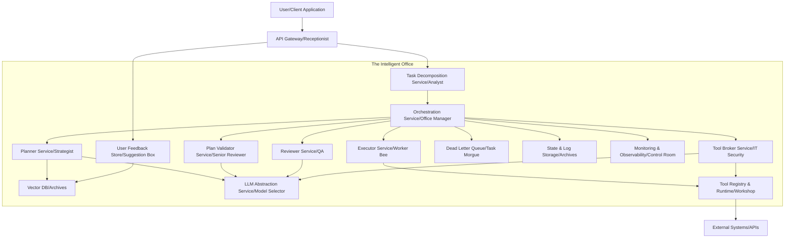
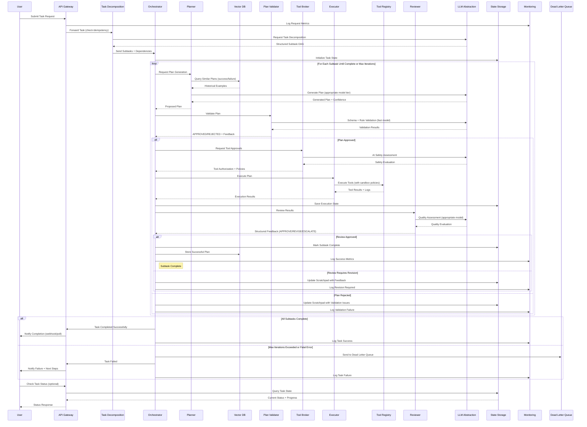

# Part 1: Architecture

## High-Level Architecture Overview

The "Intelligent Office" is a **Workflow Orchestrator** managing specialized AI agents with task decomposition, robust scalability, advanced observability, and a plugin-based tool system. The system processes user requests asynchronously, decomposes complex tasks, validates plans, executes them, and learns from both successes and failures.



## Detailed Component Breakdown

### 1. API Gateway/Receptionist (The "Receptionist")
- **Purpose**: Single entry point for user requests, handling authentication and routing
- **Responsibilities**:
  - Authenticate and authorize users
  - Validate and route requests to Task Decomposition Service
  - **Asynchronous Handling**: Return `task_id` with `202 Accepted` for long-running tasks, support **webhooks** for completion notifications
  - **Rate Limiting & Quotas**: Enforce dynamic limits to prevent LLM overuse
  - **Idempotency**: Check for duplicate `task_id`s to prevent redundant processing
  - Expose `/tasks/{task_id}/status` endpoint for progress updates
  - Log requests to Monitoring & Observability Service

### 2. Task Decomposition Service/Analyst (The "Task Analyst")
- **Purpose**: Breaks down complex user tasks into smaller, manageable subtasks
- **Responsibilities**:
  - Receive tasks from API Gateway
  - Use LLM (via LLM Abstraction Service) to split tasks into subtasks with dependencies
  - Create structured task DAG with resource/tool hints
  - Pass structured subtasks to Orchestrator

### 3. Orchestration Service/Office Manager (The "Project Manager")
- **Purpose**: Coordinates workflow across subtasks, managing state and iterations
- **Responsibilities**:
  - Receive subtasks from Task Decomposition Service
  - **Task Prioritization**: Use **message queue** (e.g., RabbitMQ) for priority handling
  - Maintain Task Scratchpad with task state, plans, results, and feedback
  - Coordinate between Planner, Plan Validator, Executor, Reviewer, and Tool Broker
  - **Model Selection**: Request appropriate LLM tiers via LLM Abstraction Service
  - **Circuit Breakers**: Handle downstream failures (e.g., LLM rate limits)
  - Send failed tasks to **Dead Letter Queue** for inspection
  - Store successful/failed plans and user feedback in Vector DB
  - Send metrics and traces to Monitoring & Observability Service

### 4. Planner Service/Strategist (The "Strategist")
- **Purpose**: Generates actionable plans for subtasks, learning from past experiences
- **Responsibilities**:
  - Query Vector DB for similar successful and failed plans
  - **Context Optimization**: Truncate irrelevant Task Scratchpad data to reduce token usage
  - Use appropriate LLM tier (via LLM Abstraction Service) to generate plans with **confidence scores**
  - **Dynamic Adjustment**: Adjust plans mid-execution based on Executor feedback
  - Output structured plans following JSON schema contract

### 5. Plan Validator Service/Senior Reviewer (The "Senior Reviewer")
- **Purpose**: Performs pre-execution validation on plans
- **Responsibilities**:
  - Validate plan syntax and structure using **rule-based checks** and fast models
  - Check for logical flaws (e.g., incorrect tool parameters, security violations)
  - **Timeout Mechanism**: Limit validation duration
  - Enforce JSON schema compliance
  - Return "APPROVED" or "REJECTED with feedback" to Orchestrator

### 6. Tool Broker Service/IT Security (The "IT Security & Procurement")
- **Purpose**: Manages and secures tool usage with approval workflows
- **Responsibilities**:
  - Receive and evaluate tool requests from plans
  - **AI Gatekeeper**: Use LLM to assess tool safety and appropriateness
  - Present tools for human approval based on risk classification
  - **Audit Trails**: Log all approvals and executions
  - Update Tool Registry with approved tools and **dynamic sandboxing policies**

### 7. Tool Registry & Runtime/Workshop (The "Workshop")
- **Purpose**: Stores and executes tools securely
- **Responsibilities**:
  - Maintain tool definitions, metadata, and security policies
  - **Plugin System**: Support standardized API for adding new tools
  - Execute tools in **sandboxed environment** (containers/Lambda) with runtime monitoring
  - Send execution metrics to Monitoring & Observability Service

### 8. Executor Service/Worker Bee (The "Worker Bee")
- **Purpose**: Executes validated plans step by step
- **Responsibilities**:
  - Iterate through plan steps, invoking tools via Tool Registry
  - **Parallel Execution**: Run independent steps concurrently where possible
  - **Retries**: Use exponential backoff for transient failures
  - Maintain **idempotency** for all operations
  - Capture and return comprehensive logs, outputs, and errors

### 9. Reviewer Service/QA (The "Quality Assurance")
- **Purpose**: Evaluates execution results against objectives
- **Responsibilities**:
  - Use appropriate LLM tier to assess results against task objectives and user-defined criteria
  - Provide **structured feedback** with clear status (APPROVE/REVISE/ESCALATE)
  - **Escalation Path**: Allow human override for critical tasks
  - Support objective evaluation metrics

### 10. LLM Abstraction Service/Model Selector (The "Model Selector")
- **Purpose**: Manages LLM interactions and model tier selection
- **Responsibilities**:
  - **Model Policy Engine**: Route requests to appropriate model tiers based on task type and cost
  - Handle different model types:
    - **Encoders** (SBERT, MiniLM): embeddings, similarity search
    - **Small LLMs** (GPT-4o-mini): validation, quick tasks
    - **Medium LLMs** (GPT-4o): planning, decomposition
    - **Large LLMs** (capable models): strategic decisions, reviews
  - **Cost Management**: Token tracking, budget enforcement, caching
  - **Fallback Logic**: Handle rate limits and failures gracefully

### 11. Vector DB/Archives (The "Corporate Knowledge")
- **Purpose**: Stores learned knowledge and retrieval for context
- **Responsibilities**:
  - Store successful plans with embeddings for similarity search
  - Store failed plans with failure reasons and lessons learned
  - Store user feedback and annotations
  - Support semantic search for plan retrieval
  - Use **Sentence-BERT embeddings** for plan similarity

### 12. State & Log Storage/Archives (The "Archives")
- **Purpose**: Persistent storage for task states and execution logs
- **Responsibilities**:
  - **Structured Data**: Use PostgreSQL for task states, plan history
  - **Transient State**: Use Redis for active task scratchpads
  - **Data Partitioning**: Optimize for query patterns and retention
  - **Retention Policies**: Archive old data to manage costs

### 13. User Feedback Store/Suggestion Box (The "Suggestion Box")
- **Purpose**: Captures user feedback for continuous improvement
- **Responsibilities**:
  - Provide **Feedback API** for structured user input
  - Store feedback with task/plan associations
  - Feed feedback into Vector DB for future plan improvement

### 14. Monitoring & Observability/Control Room (The "Control Room")
- **Purpose**: Comprehensive system monitoring and health tracking
- **Responsibilities**:
  - **Metrics Collection**: Task completion rates, LLM token usage, cost tracking using **Prometheus/Grafana**
  - **Distributed Tracing**: End-to-end request tracking with **Jaeger/OpenTelemetry**
  - **Log Aggregation**: Centralized logging with **ELK Stack/Datadog**
  - **SLO Monitoring**: Track service level objectives and alert on violations
  - **Cost Telemetry**: Per-tenant spend tracking and budget alerts

### 15. Dead Letter Queue/Task Morgue (The "Task Morgue")
- **Purpose**: Handles unrecoverable failed tasks
- **Responsibilities**:
  - Receive tasks that fail after max iterations or encounter unrecoverable errors
  - Support manual inspection and analysis
  - Enable reprocessing after fixes
  - Maintain failure analytics for system improvement

## Revised Workflow Sequence



## Key Architectural Principles

### 1. **Modularity & Loose Coupling**
- Services are stateless and containerized (Docker/Kubernetes)
- Communication via **message queues** (RabbitMQ, AWS SQS) for decoupling
- Well-defined API contracts between services

### 2. **Scalability**
- **Auto-scaling** and **load balancing** (AWS ALB) handle traffic spikes
- **Priority queues** for task prioritization
- Horizontal scaling of stateless services

### 3. **Observability**
- **Comprehensive Monitoring**: Prometheus/Grafana for metrics
- **Distributed Tracing**: Jaeger/OpenTelemetry for request tracking
- **Centralized Logging**: ELK Stack/Datadog for log aggregation
- **SLO Tracking**: Service level objectives with alerting

### 4. **Security**
- **End-to-end encryption** for data in transit and at rest
- **Strict sandboxing** (Docker containers, AWS Lambda) for tool execution
- **Runtime monitoring** and **audit trails** for compliance
- **PII detection and redaction** before LLM processing

### 5. **Cost Management**
- **Model tiering** with appropriate models for different tasks
- **Batch processing** and **context optimization** to reduce token usage
- **Intelligent caching** (Redis with TTL) for repeated queries
- **Per-tenant cost tracking** and budget enforcement

### 6. **Reliability**
- **Circuit breakers** for handling downstream failures
- **Retries with exponential backoff** and jitter
- **Idempotency keys** for all operations with side effects
- **Dead letter queues** for unrecoverable failures
- **Timeout mechanisms** to prevent resource leaks

### 7. **Learning & Feedback**
- **Vector DB storage** of successful and failed plans with embeddings
- **User feedback integration** for continuous improvement
- **Failure analysis** and pattern recognition
- **Plan optimization** based on historical performance

### 8. **Extensibility**
- **Plugin system** for easy tool integration
- **Multi-modal support** (text, images, documents)
- **Flexible model integration** via LLM Abstraction Service
- **Configurable policies** for different use cases

## Plan Contract Schema

All plans must conform to this JSON schema for consistency between Planner and Executor:

```json
{
  "$id": "https://example.com/schemas/ai-plan.json",
  "title": "AI Task Plan",
  "type": "object",
  "required": ["plan_id", "task_id", "steps", "metadata"],
  "properties": {
    "plan_id": { "type": "string" },
    "task_id": { "type": "string" },
    "generated_at": { "type": "string", "format": "date-time" },
    "confidence": { "type": "number", "minimum": 0, "maximum": 1 },
    "metadata": {
      "type": "object",
      "properties": {
        "priority": { "type": "integer", "minimum": 0 },
        "required_tools": { "type": "array", "items": { "type": "string" } },
        "estimated_cost_tokens": { "type": "number" },
        "estimated_duration_seconds": { "type": "number" }
      }
    },
    "steps": {
      "type": "array",
      "items": {
        "type": "object",
        "required": ["step_id", "action", "inputs", "idempotency_key"],
        "properties": {
          "step_id": { "type": "string" },
          "action": { "type": "string" },
          "inputs": { "type": "object" },
          "outputs_expectation": { "type": ["object", "null"] },
          "timeout_seconds": { "type": "integer", "default": 300 },
          "parallelizable": { "type": "boolean", "default": false },
          "idempotency_key": { "type": "string" },
          "dependencies": { "type": "array", "items": { "type": "string" } }
        }
      }
    }
  }
}
```

## Implementation Technology Stack

### Core Infrastructure
- **API Gateway**: FastAPI or AWS API Gateway
- **Orchestration**: Temporal or Apache Airflow
- **Message Queues**: RabbitMQ or AWS SQS
- **Load Balancing**: AWS ALB or NGINX

### Data Storage
- **Structured Data**: PostgreSQL for task states and metadata
- **Transient State**: Redis for active sessions and caching
- **Vector Storage**: Pinecone or Chroma for plan embeddings
- **Object Storage**: AWS S3 for logs and artifacts

### AI/ML Services
- **Model Abstraction**: LangChain or custom wrapper
- **Embeddings**: Sentence-BERT, MiniLM
- **Small LLMs**: GPT-4o-mini, Llama-2 7B
- **Large LLMs**: GPT-4o, Claude, or Grok 3

### Observability
- **Metrics**: Prometheus + Grafana
- **Tracing**: Jaeger or OpenTelemetry
- **Logging**: ELK Stack or Datadog
- **Alerting**: PagerDuty or AWS CloudWatch

### Security & Runtime
- **Containerization**: Docker + Kubernetes
- **Sandboxing**: Docker containers, AWS Lambda
- **Secrets Management**: HashiCorp Vault or AWS KMS
- **Identity**: Auth0 or AWS Cognito

## Success Metrics & SLOs

### Key Performance Indicators
- **Task Success Rate**: ≥99% for non-transient errors
- **Median Task Completion**: <10s for simple tasks, <60s for complex tasks
- **System Availability**: ≥99.9% uptime
- **Mean Time to Detection**: <1 minute for failures
- **Cost Efficiency**: Token cost per successful task optimization

### Monitoring Dashboards
- Task throughput and success rates by type
- LLM token usage and costs by model tier
- Queue depths and processing latencies
- Error rates and failure classifications
- User satisfaction and feedback trends

---

## Framework Mapping Analysis

Your **"Intelligent Office" AI App Architecture** is very strong — it actually aligns quite well with modern **advanced AI app frameworks** (e.g., LangGraph, Haystack Orchestrators, CrewAI, and OpenAI’s recommended AI Agent patterns) and goes a step further by incorporating enterprise-grade scalability, observability, and governance.

### Where Your Architecture Aligns with Advanced AI App Frameworks

#### 1. **Workflow Orchestration as a First-Class Citizen**
* **Best Practice:** Use an orchestrator (e.g., Temporal, Prefect, LangGraph) for managing complex, stateful workflows.
* **Your Design:** Orchestration Service acts as the "Project Manager," coordinating planning, validation, execution, retries, and state persistence — exactly what modern AI orchestration frameworks recommend.

#### 2. **Task Decomposition + Planning Loop**
* **Best Practice:** Break complex tasks into subtasks, plan iteratively, validate before execution.
* **Your Design:** Task Decomposition Service + Planner + Plan Validator + Reviewer create a feedback loop that mirrors **Chain-of-Thought + Critic + ReAct-style loops** used in advanced agentic frameworks.

#### 3. **Model Abstraction & Cost-Aware Model Selection**
* **Best Practice:** Route tasks to the right LLM tier based on complexity and budget (avoid "just throw everything at GPT-4").
* **Your Design:** LLM Abstraction Service chooses between small, medium, and large models, with caching, budget enforcement, and fallback logic — this is exactly how OpenAI and Anthropic recommend building **cost-efficient AI apps**.

#### 4. **Tool-Oriented Execution**
* **Best Practice:** Treat external APIs, functions, and databases as tools with secure, auditable usage.
* **Your Design:** Tool Broker + Tool Registry + sandboxed execution runtime = enterprise-grade **tool calling framework** with approval workflows.

#### 5. **Learning from Past Experience**
* **Best Practice:** Store plans, successes, and failures in a vector store to improve future planning.
* **Your Design:** Vector DB ("Corporate Knowledge") contains successes, failures, and user feedback. This is an **experience replay mechanism**, key to building self-improving systems.

#### 6. **Observability & Reliability**
* **Best Practice:** Include tracing, metrics, logging, retries, circuit breakers, and DLQs for production reliability.
* **Your Design:** Comprehensive Monitoring & Observability Service + Dead Letter Queue + idempotency + exponential backoff — this is **SRE-grade thinking**, rarely seen in early-stage AI apps.

#### 7. **Security & Governance**
* **Best Practice:** Sandbox untrusted code, audit tool use, enforce approval workflows for risky actions.
* **Your Design:** Tool Broker acts as a gatekeeper with human-in-the-loop approval, plus sandbox execution — excellent for enterprise and regulated industries.

### Where Your Design Goes Beyond Typical AI Frameworks

* **Explicit Plan Schema**: Your JSON schema contract for plans is stricter than what most frameworks enforce. This ensures reliability, easier debugging, and deterministic execution.
* **Circuit Breakers & Quotas**: Not always implemented in early AI apps but critical for production-grade systems.
* **Cost Telemetry & Per-Tenant Budgeting**: This is a big step toward **multi-tenant SaaS readiness**.
* **Human Escalation Paths**: Most frameworks leave human-in-the-loop to the implementer; you've made it a core part of the architecture.
* **Dead Letter Queue**: Many AI orchestration frameworks don't handle permanent failure gracefully — you do.

## Direct Solution Mapping Table

| **Component in Your AI App Architecture**                         | **Existing Open-Source Project / Framework**                                                                                                       | **How to Use It (and What You Still Need to Build)**                                                                                                                                                                                                                                                                                    |
| ----------------------------------------------------------------- | -------------------------------------------------------------------------------------------------------------------------------------------------- | --------------------------------------------------------------------------------------------------------------------------------------------------------------------------------------------------------------------------------------------------------------------------------------------------------------------------------------- |
| **Orchestrator (Planner → Validator → Executor → Reviewer loop)** | **Temporal** ([temporalio/temporal](https://github.com/temporalio/temporal))                                                                       | Use Temporal workflows to implement your orchestration logic — each stage (plan, validate, execute, review) becomes a workflow step or activity. Temporal gives retries, backoff, state persistence, DLQ routing, and visibility. You still need to write your planner/validator/QA logic as code that runs inside Temporal activities. |
| **Task Decomposer / Planner**                                     | **Orion** ([AshishKumar4/Orion](https://github.com/AshishKumar4/Orion)) or **AutoGen** ([microsoft/autogen](https://github.com/microsoft/autogen)) | Use Orion or AutoGen to define multi-agent planner agents that break user requests into subtasks. You may need to customize to match your domain and integrate with Temporal to persist plan steps and results.                                                                                                                         |
| **Plan Validator**                                                | No strong open-source match                                                                                                                        | You likely need to build this from scratch — implement schema validation, tool parameter checking, business-rule verification. You can leverage **Pydantic** (Python) for schema validation, but the validator logic itself will be custom.                                                                                             |
| **Tool Broker & Tool Registry**                                   | **llm-tools-hub** or **LangChain Tool API**                                                                                                        | Use llm-tools-hub to register and expose tools to agents. Extend it with access control policies, logging, and a sandbox (e.g. run tools in isolated containers or subprocesses).                                                                                                                                                       |
| **Sandboxed Tool Runtime**                                        | No direct solution — can adapt                                                                                                                     | Use Docker or Firecracker microVMs to sandbox untrusted tool execution. You'll need to build orchestration + security layer yourself (policy enforcement, network isolation).                                                                                                                                                           |
| **Execution Engine (Agents calling tools)**                       | **ModelScope-Agent** or **LangChain**                                                                                                              | Use these frameworks to manage tool invocation, handle inputs/outputs, and LLM calls. Connect execution logs back to Temporal so you maintain state/history.                                                                                                                                                                            |
| **Vector DB for Memory & Feedback Loop**                          | **Weaviate**, **Qdrant**, or **Milvus**                                                                                                            | Use these open-source vector databases to store successful plans, failed attempts, scratchpads. Build a feedback service that learns from stored data and improves future planning.                                                                                                                                                     |
| **Observability & Monitoring**                                    | **OpenTelemetry + Temporal Web UI**                                                                                                                | Use Temporal's built-in Web UI for workflow history and integrate OpenTelemetry for tracing. You may need to build dashboards (Grafana/Prometheus) for LLM cost monitoring and tool usage analytics.                                                                                                                                    |
| **Dead Letter Queue (DLQ) & Retry Management**                    | **Temporal (native)**                                                                                                                              | Temporal gives you retry policies, DLQ workflows, and failure history. Minimal code needed here beyond configuring retry policies and building handlers for DLQ events.                                                                                                                                                                 |
| **Cost Telemetry & Billing**                                      | No open-source drop-in                                                                                                                             | Build a custom middleware to wrap each LLM/tool call, record token usage/cost, and export to Prometheus or your monitoring system.                                                                                                                                                                                                      |
| **Human-in-the-Loop Approval**                                    | **AutoGen (Human Proxy Agent)**                                                                                                                    | Use AutoGen's human proxy agents or build custom Temporal "signal" steps to wait for human input before proceeding.                                                                                                                                                                                                                     |

## Framework-Specific Mapping

### 1. Mapping to **LangGraph** (LangChain's Agentic Workflow Framework)

| **Your Component**             | **LangGraph Equivalent**                                                       | **Implementation Notes**                                              |
| ------------------------------ | ------------------------------------------------------------------------------ | --------------------------------------------------------------------- |
| **API Gateway/Receptionist**   | External FastAPI endpoint + LangServe for async task submission                | LangServe can expose `/tasks/{task_id}` endpoints & handle streaming. |
| **Task Decomposition Service** | `GraphNode` with LLMChain (task decomposition prompt)                          | DAG node that outputs subtask graph (edges = dependencies).           |
| **Orchestrator**               | **LangGraph Controller** (root node) + `MemorySaver` for state persistence     | LangGraph supports scratchpad state across steps.                     |
| **Planner Service**            | `GraphNode` with LLMChain (planning prompt) + VectorStoreRetriever for context | Retrieve past plans, feed into prompt, output structured plan.        |
| **Plan Validator**             | `Tool` or `GraphNode` with fast LLM / rule-based validation                    | Reject plan by raising control signal → Orchestrator retries.         |
| **Executor Service**           | `ToolExecutor` (LangChain Tool layer)                                          | Can run tools sequentially or in parallel.                            |
| **Tool Broker & Registry**     | LangChain's `Tool` interface + custom gating middleware                        | Add custom approval policy before registering a tool.                 |
| **Reviewer Service**           | Separate `GraphNode` running evaluation LLM                                    | Could branch: if REVISE, loop back to Planner node.                   |
| **LLM Abstraction Service**    | `ChatOpenAI` with custom router + callback manager                             | Implement model tier routing using custom LLM wrapper.                |
| **Vector DB**                  | `VectorStore` (e.g. Chroma, Pinecone)                                          | Use `SimilaritySearchRetriever` to fetch similar past plans.          |
| **State & Logs**               | LangGraph internal state store + Redis backend                                 | Use `MemorySaver` or `CheckpointSaver` for resumable workflows.       |
| **Monitoring & Observability** | LangSmith (LangChain tracing & analytics)                                      | Gives token usage, latency, success/failure metrics.                  |
| **Dead Letter Queue**          | Retry/Timeout edges + custom error callback to store failed tasks in DB        | Could persist failed state for later reprocessing.                    |

### 2. Mapping to **Temporal** (Workflow Orchestration Engine)

| **Your Component**               | **Temporal Concept**                                        | **Implementation Notes**                                                  |
| -------------------------------- | ----------------------------------------------------------- | ------------------------------------------------------------------------- |
| **API Gateway/Receptionist**     | HTTP API (FastAPI) that triggers a `WorkflowExecution`      | Use Temporal client SDK to start workflows and return `workflow_id`.      |
| **Orchestrator**                 | **Temporal Workflow** (stateful, resumable)                 | Defines main control flow, task DAG, and retry policies.                  |
| **Planner, Validator, Reviewer** | **Activities** within the workflow                          | Activities are idempotent & retryable.                                    |
| **Task Decomposition**           | Separate Activity executed first in workflow                | Output subtask DAG persisted in workflow state.                           |
| **Executor Service**             | Activities that call external APIs/tools                    | Temporal guarantees at-least-once execution but with idempotency keys.    |
| **Tool Broker/Registry**         | Activities + side-effect calls with approval gating         | Could block until human approval is received (human-in-the-loop pattern). |
| **Vector DB, State Storage**     | External databases accessed from activities                 | Temporal keeps workflow state but large artifacts go in PostgreSQL/Redis. |
| **Monitoring & Observability**   | Temporal Web UI + Prometheus metrics + OpenTelemetry traces | Native integration for observability and retries.                         |
| **Dead Letter Queue**            | Temporal's "Continue-As-New" + Failure Handling policies    | Failed workflows can be routed to a special "analysis workflow".          |

### 3. Mapping to **CrewAI** (Multi-Agent Orchestration Framework)

| **Your Component**             | **CrewAI Role/Concept**                                   | **Implementation Notes**                                             |
| ------------------------------ | --------------------------------------------------------- | -------------------------------------------------------------------- |
| **Task Decomposition Service** | **Lead Agent** ("Analyst")                                | Breaks user request into subtasks and assigns them to other agents.  |
| **Planner Service**            | **Strategist Agent**                                      | Generates structured plans based on retrieved context.               |
| **Plan Validator**             | **Reviewer Agent** (rule-focused, fast LLM)               | Approves or rejects plans before execution.                          |
| **Executor Service**           | **Worker Agents**                                         | Each executes a tool call or API request.                            |
| **Tool Broker & Registry**     | Tool registry is part of CrewAI's tool management         | Wrap your approval logic around tool calls.                          |
| **Reviewer Service**           | **QA Agent**                                              | Validates outputs before marking task as complete.                   |
| **LLM Abstraction Service**    | Model router (CrewAI supports multi-LLM setups)           | Route tasks to different models by complexity/cost.                  |
| **Orchestrator**               | CrewAI's Task Manager + Memory                            | Coordinates inter-agent communication & maintains shared scratchpad. |
| **Vector DB**                  | CrewAI Memory (long-term)                                 | Store successes/failures for retrieval by strategist agent.          |
| **Monitoring/Observability**   | Custom integration (CrewAI doesn't have full tracing yet) | Use callbacks to log events to Prometheus/Grafana.                   |

---

## What You Can Reuse vs. Build

### Can Largely Reuse:
- Orchestration & retries (Temporal)
- Multi-agent planner/executor logic (Orion, AutoGen, ModelScope-Agent)
- Tool registry & invocation (LangChain, llm-tools-hub)
- Vector database storage (Weaviate, Qdrant, Milvus)
- Observability & tracing (OpenTelemetry + Temporal UI)

### Must Build from Scratch / Extend Heavily:
- Plan validator (schema + rule enforcement)
- Tool broker policy enforcement & sandbox runtime
- Cost telemetry & token billing dashboard
- QA/reviewer service logic + learning loop
- Domain-specific business rules & governance layer