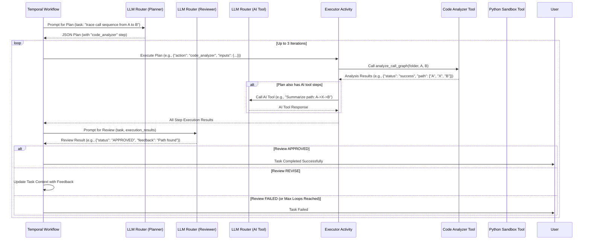

# Part 3: MVP Implementation

## MVP Workflow Implementation for Plan → Execute → Review → Loop

This implementation provides a lean but production-ready MVP solution using Temporal for orchestration and a multi-provider LLM router for flexibility and cost efficiency. It includes specific code for the Planner, Executor, and Reviewer activities, along with a custom "Code Analyzer" tool for the requested use case (call sequence tracing).

### Core Implementation (Python)

```python
# requirements:
# pip install temporalio google-generativeai mistralai openai

import asyncio, json, traceback
import os, ast
from collections import defaultdict, deque
from datetime import timedelta # Needed for Temporal timeouts

from temporalio import workflow, activity
import google.generativeai as genai
from mistralai.client import MistralClient
from openai import OpenAI

# === CONFIG ===
# Replace with actual API keys or environment variables
GEMINI_API_KEY = os.getenv("GEMINI_API_KEY", "your-gemini-key")
MISTRAL_API_KEY = os.getenv("MISTRAL_API_KEY", "your-mistral-key")
OPENAI_API_KEY = os.getenv("OPENAI_API_KEY", "your-openai-key")

# Initialize clients (ensure API keys are valid)
try:
    if GEMINI_API_KEY:
        genai.configure(api_key=GEMINI_API_KEY)
    if MISTRAL_API_KEY:
        mistral_client = MistralClient(api_key=MISTRAL_API_KEY)
    if OPENAI_API_KEY:
        openai_client = OpenAI(api_key=OPENAI_API_KEY)
except Exception as e:
    print(f"Warning: Failed to initialize LLM client: {e}. Some models may not be available.")


# === MODEL ROUTER ===
async def call_ai_model(model_type: str, prompt: str, fallback=True):
    """
    Unified LLM call with fallback support based on model_type.
    model_type: "planner" | "reviewer" | "ai_tool"
    """
    workflow.logger.info(f"Calling LLM for {model_type} with prompt (first 100 chars): {prompt[:100]}")
    
    # Define providers for each model_type, ordered by preference (cost/performance)
    providers_config = {
        "planner": [("gemini-2.5-pro", "gemini"), ("gpt-4o", "openai")],
        "reviewer": [("gemini-2.5-flash", "gemini"), ("gpt-4o-mini", "openai")],
        "ai_tool": [("mistral-small", "mistral"), ("gpt-4o-mini", "openai")]
    }

    providers = providers_config.get(model_type, [])

    for model_name, provider_key in providers:
        try:
            if provider_key == "gemini":
                if not GEMINI_API_KEY: raise ValueError("Gemini API key not configured.")
                model = genai.GenerativeModel(model_name)
                response = model.generate_content(prompt)
                return response.text
            elif provider_key == "mistral":
                if not MISTRAL_API_KEY: raise ValueError("Mistral API key not configured.")
                resp = mistral_client.chat.complete(model=model_name, messages=[{"role":"user","content":prompt}])
                return resp.choices[0].message.content
            elif provider_key == "openai":
                if not OPENAI_API_KEY: raise ValueError("OpenAI API key not configured.")
                resp = openai_client.chat.completions.create(
                    model=model_name,
                    messages=[{"role":"user","content":prompt}]
                )
                return resp.choices[0].message.content
            else:
                raise ValueError(f"Unknown provider_key: {provider_key}")
        except Exception as e:
            workflow.logger.warning(f"LLM call to {model_name} failed: {e}. Trying fallback...")
            if not fallback:
                raise # If fallback is disabled, re-raise immediately
    
    # If all providers fail and fallback is true
    if fallback:
        workflow.logger.error(f"All primary LLM providers for {model_type} failed. No more fallbacks.")
    raise Exception(f"Failed to get LLM response for {model_type} after all attempts.")


# === TOOL: Python Code Analyzer ===
def analyze_call_graph(folder: str, start_func: str, end_func: str):
    """
    Analyzes Python files in a folder to build a simple call graph
    and find a path between a start and end function.
    """
    call_graph = defaultdict(list)
    func_locations = {} # To store file and line of function definitions

    # SECURITY: In a real system, folder access would be sandboxed.
    # This is an example for demonstration, assuming safe local access.
    
    if not os.path.exists(folder):
        return {"status": "error", "message": f"Folder '{folder}' not found."}

    for root, _, files in os.walk(folder):
        for f in files:
            if f.endswith(".py"):
                filepath = os.path.join(root, f)
                with open(filepath, "r", encoding="utf-8") as fp:
                    try:
                        source_code = fp.read()
                        tree = ast.parse(source_code, filename=filepath)
                        
                        for node in ast.walk(tree):
                            if isinstance(node, ast.FunctionDef):
                                func_name = node.name
                                func_locations[func_name] = f"{filepath}:{node.lineno}"
                                for sub_node in ast.walk(node):
                                    if isinstance(sub_node, ast.Call) and isinstance(sub_node.func, ast.Name):
                                        called_func_name = sub_node.func.id
                                        call_graph[func_name].append(called_func_name)
                    except Exception as e:
                        # Log parsing errors but continue
                        workflow.logger.warning(f"Skipping {filepath} due to parsing error: {e}")

    # BFS from start_func to end_func
    visited = set()
    queue = deque([(start_func, [start_func])]) # (current_func, current_path)

    while queue:
        current_func, path = queue.popleft()
        if current_func == end_func:
            return {"status": "success", "path": path, "func_locations": func_locations}
        
        # Avoid infinite loops for recursive calls or circular dependencies in graph
        if current_func in visited:
            continue
        visited.add(current_func)

        for neighbor in call_graph.get(current_func, []):
            if neighbor not in visited: # Only add if not already visited in this path
                queue.append((neighbor, path + [neighbor]))
    
    return {"status": "not_found", "path": [], "message": f"No call path found from {start_func} to {end_func}."}


# === TEMPORAL ACTIVITIES ===

# Activity for Plan Generation
@activity.defn
async def plan_activity(task: str):
    """Generates a structured plan in JSON format based on the task description."""
    prompt = f"""
    You are a highly skilled AI planner. Your goal is to create a step-by-step plan to accomplish the user's task.
    The task is: "{task}".

    If the task involves tracing a call sequence between two functions in a codebase,
    your plan must use the "code_analyzer" tool.
    The "code_analyzer" tool takes inputs: `folder` (path to codebase), `start_func`, `end_func`.

    Other general tools available:
    - "python_exec": Executes Python code. Inputs: `code` (string).
    - "web_search": Performs a web search. Inputs: `query` (string).
    - "file_operations": Reads/writes files. Inputs: `operation` ("read" or "write"), `path`, `content` (for write).
    - "http_client": Makes HTTP requests. Inputs: `method`, `url`, `headers`, `body`.
    - "math_calculator": Performs calculations. Inputs: `expression` (string).
    - "ai_tool": Use another LLM to answer a specific question. Inputs: `prompt` (string).

    Your plan must be in a JSON array format, where each object represents a step.
    Each step must have:
    - `step_id`: Unique identifier for the step (string).
    - `action`: Name of the tool to use (string, e.g., "code_analyzer", "python_exec", "ai_tool").
    - `inputs`: An object containing key-value pairs for the tool's parameters.
    - `outputs_expectation`: (Optional) A brief description of what you expect the output of this step to be.
    - `idempotency_key`: (Optional) A unique key to ensure the step is executed only once if retried.
    - `dependencies`: (Optional) An array of `step_id`s that must complete before this step can run.

    Example for code analysis:
    ```json
    {{
      "plan_id": "gen-plan-123",
      "task_id": "user-task-abc",
      "generated_at": "2025-01-01T12:00:00Z",
      "confidence": 0.95,
      "metadata": {{
        "priority": 1,
        "required_tools": ["code_analyzer"],
        "estimated_cost_tokens": 500,
        "estimated_duration_seconds": 60
      }},
      "steps": [
        {{
          "step_id": "analyze_codebase",
          "action": "code_analyzer",
          "inputs": {{
            "folder": "./src",
            "start_func": "main",
            "end_func": "process_data"
          }},
          "outputs_expectation": {{"path": ["main", "helper", "process_data"]}},
          "idempotency_key": "analyze_codebase_1"
        }},
        {{
          "step_id": "report_result",
          "action": "ai_tool",
          "inputs": {{
            "prompt": "Based on the path from 'analyze_codebase' tool, summarize the call sequence."
          }},
          "outputs_expectation": {{"summary": "Call sequence: main -> helper -> process_data"}},
          "dependencies": ["analyze_codebase"],
          "idempotency_key": "report_result_1"
        }}
      ]
    }}
    ```
    Your JSON response for the plan must conform to the Plan Contract Schema provided previously in the overall architecture.
    """
    try:
        plan_json_str = await call_ai_model("planner", prompt)
        # Attempt to parse and re-serialize to validate JSON structure
        plan_data = json.loads(plan_json_str)
        return json.dumps(plan_data, indent=2) # Return formatted JSON
    except Exception as e:
        workflow.logger.error(f"Plan generation failed: {e}")
        raise

# Activity for Plan Execution
@activity.defn
async def execute_activity(plan_json: str):
    """Executes the steps defined in the plan, invoking appropriate tools."""
    workflow.logger.info(f"Executing plan: {plan_json[:200]}...")
    try:
        plan = json.loads(plan_json)
    except json.JSONDecodeError:
        raise ValueError("Invalid plan JSON provided to executor.")
    
    results_per_step = {}
    
    # Simple dependency handling: just execute in order for MVP
    # For full DAG, a more complex scheduler would be needed
    for step in plan.get("steps", []):
        step_id = step.get("step_id", "unknown_step")
        action = step.get("action")
        inputs = step.get("inputs", {})
        
        workflow.logger.info(f"Executing step '{step_id}' with action '{action}'")

        try:
            if action == "python_exec":
                result = run_python_tool(inputs.get("code", ""))
            elif action == "ai_tool":
                result = await call_ai_model("ai_tool", inputs.get("prompt", ""))
            elif action == "code_analyzer":
                # Assuming local folder access for MVP, replace with secure access in production
                folder = inputs.get("folder")
                start_func = inputs.get("start_func")
                end_func = inputs.get("end_func")
                # SECURITY NOTE: In a real system, 'folder' should be validated/sandboxed.
                # For this MVP example, assume a relative path or pre-approved folder structure.
                result = analyze_call_graph(folder, start_func, end_func)
            elif action == "web_search":
                 # Placeholder for web search tool
                 result = {"status": "success", "result": f"Web search for '{inputs.get('query')}' (simulated)."}
            elif action == "file_operations":
                 # Placeholder for file operations
                 result = {"status": "success", "result": f"File operation '{inputs.get('operation')}' on '{inputs.get('path')}' (simulated)."}
            elif action == "http_client":
                 # Placeholder for HTTP client
                 result = {"status": "success", "result": f"HTTP {inputs.get('method')} to '{inputs.get('url')}' (simulated)."}
            elif action == "math_calculator":
                 # Placeholder for math calculator
                 try:
                    expr_result = eval(str(inputs.get('expression'))) # UNSAFE for production, for MVP only
                    result = {"status": "success", "result": expr_result}
                 except Exception as e:
                    result = {"status": "error", "error": str(e)}
            else:
                result = {"status": "error", "message": f"Unknown action: {action}"}
            
            results_per_step[step_id] = {"status": "completed", "output": result}
        except Exception as e:
            error_details = {"status": "failed", "error": str(e), "trace": traceback.format_exc()}
            workflow.logger.error(f"Step '{step_id}' failed: {e}", exc_info=True)
            results_per_step[step_id] = error_details
            # In a real system, depending on criticality, you might halt here or proceed
            # For MVP, we'll let review activity decide if it's a critical failure
            
    return json.dumps(results_per_step, indent=2)

# Activity for Reviewing Execution Results
@activity.defn
async def review_activity(task: str, execution_results: str):
    """Reviews the execution results against the original task objective."""
    workflow.logger.info(f"Reviewing results for task: {task[:100]}..., results: {execution_results[:200]}...")
    
    # Parse execution results to provide better context to the LLM
    try:
        results_data = json.loads(execution_results)
    except json.JSONDecodeError:
        results_data = {"parse_error": "Execution results are not valid JSON", "raw_results": execution_results}

    prompt = f"""
    You are an AI Quality Assurance specialist.
    The original task was: "{task}"

    Here are the execution results for the steps taken:
    {json.dumps(results_data, indent=2)}

    Based on the original task and the execution results, determine if the task was successfully completed.
    Specifically for the code call sequence task:
    - Check if the "code_analyzer" tool was used and if it reported "status": "success".
    - Verify if a "path" was found.

    Respond with a JSON object containing:
    - `status`: "APPROVED", "REVISE", or "FAILED".
    - `feedback`: A string explaining the decision, providing constructive criticism if "REVISE" or "FAILED".
    - `final_output`: (Optional) The extracted final output if status is "APPROVED".

    Example APPROVED for call sequence:
    ```json
    {{"status": "APPROVED", "feedback": "Successfully traced the call sequence.", "final_output": ["main", "step1", "step2", "process_data"]}}
    ```
    Example REVISE:
    ```json
    {{"status": "REVISE", "feedback": "The call graph analysis failed. Ensure the folder path is correct and accessible. Planner needs to regenerate the plan with a valid folder or error handling for tool."}}
    ```
    Example FAILED:
    ```json
    {{"status": "FAILED", "feedback": "Max iterations reached, and the task could not be completed successfully. The code analyzer consistently failed."}}
    ```
    """
    
    try:
        review_json_str = await call_ai_model("reviewer", prompt)
        review_data = json.loads(review_json_str)
        # Basic validation of review structure
        if "status" not in review_data or "feedback" not in review_data:
            raise ValueError("Review LLM did not return expected JSON structure.")
        return json.dumps(review_data, indent=2)
    except Exception as e:
        workflow.logger.error(f"Review generation or parsing failed: {e}", exc_info=True)
        # Fallback for critical review failure: assume revision needed
        return json.dumps({"status": "REVISE", "feedback": f"Review process failed: {e}. Planner needs to re-evaluate."})


# === TEMPORAL WORKFLOW ===
@workflow.defn
class PlanExecuteReviewWorkflow:
    @workflow.run
    async def run(self, task: str):
        workflow.logger.info(f"Starting workflow for task: {task}")
        max_loops = 3 # Limits iterations to prevent runaway costs/loops
        workflow_state = {"initial_task": task, "current_task_context": task, "history": []}

        for i in range(max_loops):
            workflow.logger.info(f"Workflow iteration {i+1}/{max_loops}")
            current_task_context = workflow_state["current_task_context"]

            try:
                plan_json = await workflow.execute_activity(
                    plan_activity, current_task_context, schedule_to_close_timeout=timedelta(seconds=30)
                )
                workflow.logger.info(f"Plan generated (first 100 chars): {plan_json[:100]}...")
            except Exception as e:
                workflow.logger.error(f"Plan activity failed in iteration {i+1}: {e}", exc_info=True)
                workflow_state["history"].append({"iteration": i+1, "stage": "plan", "status": "failed", "error": str(e)})
                # Attempt to revise the task context for planning in the next loop if possible
                workflow_state["current_task_context"] += f"\nPrevious planning attempt failed: {e}. Please try a different approach."
                continue # Skip execution and review, go to next iteration

            try:
                execution_results = await workflow.execute_activity(
                    execute_activity, plan_json, schedule_to_close_timeout=timedelta(seconds=60)
                )
                workflow.logger.info(f"Execution results (first 100 chars): {execution_results[:100]}...")
            except Exception as e:
                workflow.logger.error(f"Execute activity failed in iteration {i+1}: {e}", exc_info=True)
                workflow_state["history"].append({"iteration": i+1, "stage": "execute", "status": "failed", "error": str(e), "plan": plan_json})
                workflow_state["current_task_context"] += f"\nPrevious execution failed: {e}. Review the plan for correctness or tool issues."
                continue # Skip review, go to next iteration

            review_json = await workflow.execute_activity(
                review_activity, workflow_state["initial_task"], execution_results, schedule_to_close_timeout=timedelta(seconds=30)
            )
            review_data = json.loads(review_json)
            
            workflow_state["history"].append({
                "iteration": i+1,
                "stage": "review",
                "plan": plan_json,
                "execution_results": execution_results,
                "review_status": review_data.get("status"),
                "review_feedback": review_data.get("feedback")
            })

            if review_data.get("status") == "APPROVED":
                workflow.logger.info(f"Task APPROVED in iteration {i+1}. Final output: {review_data.get('final_output')}")
                return {"status": "completed", "final_output": review_data.get("final_output"), "history": workflow_state["history"]}
            elif review_data.get("status") == "REVISE":
                workflow.logger.info(f"Task requires REVISION in iteration {i+1}. Feedback: {review_data.get('feedback')}")
                workflow_state["current_task_context"] += f"\nRevision feedback: {review_data.get('feedback')}"
            else: # FAILED status from reviewer
                workflow.logger.warning(f"Task FAILED by reviewer in iteration {i+1}. Reason: {review_data.get('feedback')}")
                return {"status": "failed", "reason": review_data.get('feedback'), "history": workflow_state["history"]}
        
        workflow.logger.warning(f"Max iterations ({max_loops}) reached for task: {task}. Task remains incomplete.")
        return {"status": "failed", "reason": "Max iterations reached", "history": workflow_state["history"]}

```

### How This MVP Implementation Works

1.  **Configuration**: API keys for Gemini, Mistral, and OpenAI are loaded from environment variables.
2.  **LLM Router (`call_ai_model`)**:
    *   This function acts as your `LLM Abstraction Service`.
    *   It tries preferred models first (e.g., Gemini for `planner` and `reviewer`, Mistral for `ai_tool`).
    *   If a call fails (e.g., rate limit, API error, or missing API key), it automatically attempts to use a fallback model (e.g., OpenAI's GPT-4o-mini).
    *   It logs which model is being used and any failures.
3.  **Code Analyzer Tool (`analyze_call_graph`)**:
    *   This is a custom Python function acting as a "Tool".
    *   It uses Python's `ast` module to statically parse `.py` files in a given folder.
    *   It constructs a simple function call graph (function `A` calls function `B`).
    *   It performs a Breadth-First Search (BFS) to find a call path from a `start_func` to an `end_func`.
    *   **Security Note**: Directly executing arbitrary file system operations or `exec()` in a production environment is highly dangerous. For a real system, `analyze_call_graph` would interface with a securely sandboxed environment (e.g., a Docker container or a dedicated microservice with restricted permissions) to access the code.
4.  **Temporal Activities**:
    *   `plan_activity`: Calls the LLM Router with `model_type="planner"` and a detailed prompt to generate a JSON plan. It expects the plan to include steps using the `code_analyzer` tool if the task involves code analysis.
    *   `execute_activity`: Parses the `plan_json`. It iterates through steps, calling the appropriate local Python functions (like `run_python_tool`, `analyze_call_graph`) or `call_ai_model` for `ai_tool` steps.
    *   `review_activity`: Calls the LLM Router with `model_type="reviewer"` to evaluate the execution results against the original task. It's prompted to look specifically for the success/failure of the `code_analyzer` and the presence of a path.
5.  **Temporal Workflow (`PlanExecuteReviewWorkflow`)**:
    *   This is the core orchestrator.
    *   It runs a `max_loops` (e.g., 3) iteration loop.
    *   In each loop, it calls `plan_activity`, `execute_activity`, and `review_activity` sequentially.
    *   If the `review_activity` returns "APPROVED", the workflow completes.
    *   If "REVISE", the `task` description is updated with feedback, and the loop continues for a new plan generation.
    *   If "FAILED" or `max_loops` are reached, the workflow reports failure.
    *   `workflow.logger` is used for internal logging, visible in the Temporal Web UI.
    *   `timedelta` is used for `schedule_to_close_timeout` on activities, ensuring activities don't hang indefinitely.

### High-Level MVP Workflow


### MVP Use Case: Grep Code and Create Call Sequence

**Goal:** Given a folder with source code and user-provided start/end functions, output a call sequence (chain of function calls) connecting them.

**Example Task**: "Analyze the Python files in the `./src` folder and create a call sequence where the start function is `main` and the end function is `process_data`."

**How the MVP handles it:**

1.  **User Submission**: The user submits the task via the API Gateway (FastAPI).
2.  **Orchestrator (Temporal Workflow) Starts**: A `PlanExecuteReviewWorkflow` instance is initiated.
3.  **Planner Activity**:
    *   The `plan_activity` is executed.
    *   The `LLM Router` (using **Gemini 2.5 Pro**) receives a prompt guiding it to use the `code_analyzer` tool.
    *   The planner generates a JSON plan that includes a step with `action: "code_analyzer"` and `inputs: {"folder": "./src", "start_func": "main", "end_func": "process_data"}`.
4.  **Executor Activity**:
    *   The `execute_activity` is invoked with the generated plan.
    *   It identifies the `code_analyzer` step.
    *   It calls the `analyze_call_graph("./src", "main", "process_data")` function (which acts as your `Code Analyzer Tool`).
    *   The `analyze_call_graph` tool scans the Python files, builds a call graph, and attempts to find a path. Let's assume it finds `["main", "helper_function", "process_data"]`.
    *   The execution results are collected.
5.  **Reviewer Activity**:
    *   The `review_activity` is invoked with the original task and the execution results.
    *   The `LLM Router` (using **Gemini 2.5 Flash**) receives a prompt asking it to evaluate if the task (finding the call sequence) was successful based on the `code_analyzer`'s output.
    *   If `analyze_call_graph` returned `{"status": "success", "path": [...]}` and the path is valid, the reviewer responds with `{"status": "APPROVED", "feedback": "Successfully traced call sequence", "final_output": ["main", "helper_function", "process_data"]}`.
6.  **Workflow Completion**: The Temporal workflow receives the "APPROVED" status, marks the task as complete, and returns the final call sequence to the API Gateway for the user. If no path was found or an error occurred, the reviewer would request `REVISE` (to prompt the planner to try again, possibly with different parameters or by breaking down the problem further) or `FAILED`.

This MVP provides a functional, self-correcting loop for complex tasks like static code analysis using AI agents and robust orchestration.