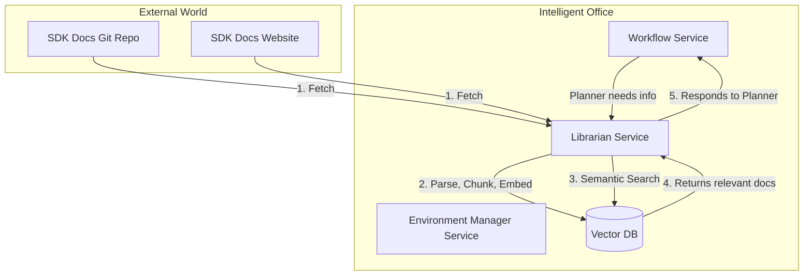
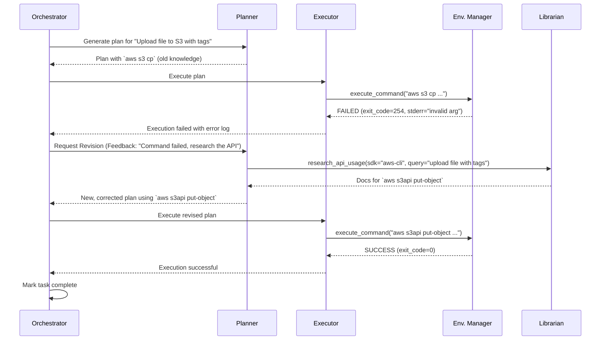

## Part 4 Addendum: The Dynamic Knowledge & Adaptation Layer

To solve the problem of changing SDKs, we introduce a new service and a new meta-tool that allow the AI to **dynamically research and learn API documentation at runtime**. This turns the AI from a static tool-user into a self-sufficient learner.

### 1. New Service: The "Librarian" (Documentation & Knowledge Service)

The Librarian service is responsible for ingesting, indexing, and providing on-demand access to technical documentation for any SDK, API, or framework the AI might need. It acts as the AI's "Google" or "Stack Overflow" for API usage.

#### 1.1. High-Level Architecture Integration

The Librarian service integrates with the existing Vector DB and provides a new tool for the Planner.



#### 1.2. The Ingestion Pipeline (How the Librarian Learns)

This is an asynchronous, scheduled process that keeps the knowledge base up-to-date.

1.  **Source Connectors**: The Librarian has connectors to pull documentation from various sources (e.g., Git repositories containing Markdown, public websites with API references).
2.  **Fetch & Parse**: It regularly fetches the latest documentation. It uses parsers (e.g., `Unstructured.io`) to extract clean text and code blocks from HTML, Markdown, or reStructuredText.
3.  **Semantic Chunking**: The parsed content is chunked intelligently, not by fixed size, but by logical sections (e.g., one chunk per function, class, or CLI command).
4.  **Embed & Index**: Each chunk is converted into a vector embedding and stored in the **Vector DB**. Crucially, it's stored with rich metadata:
    *   `sdk_name`: (e.g., `aws-cli`, `kubernetes-python-client`)
    *   `sdk_version`: (e.g., `2.15.0`, `29.0.0`)
    *   `entity_name`: (e.g., `s3api put-object`, `CoreV1Api.create_namespaced_pod`)
    *   `source_url`: A direct link to the original documentation page.

### 2. The Planner's New Meta-Tool: The "Research Assistant"

The Planner gains a new, powerful tool to query the Librarian service.

*   **`research_api_usage`**
    *   **Description**: Queries the internal knowledge base for up-to-date documentation on how to use a specific SDK, CLI tool, or API. This should be used when a command fails with an unknown argument or syntax error, suggesting the tool's API has changed since the model's training.
    *   **Inputs Schema**:
        ```json
        {
          "sdk_name": "The name of the SDK or tool (e.g., 'aws-cli', 'kubectl').",
          "query": "A natural language question about the task (e.g., 'how to upload a file to s3 with server-side encryption').",
          "version": "Optional specific version to query."
        }
        ```
    *   **Output**:
        ```json
        {
          "error": false,
          "summary": "An LLM-generated summary of the best approach based on the findings.",
          "snippets": [
            {
              "content": "The full text of the relevant documentation chunk.",
              "source_url": "URL to the original documentation.",
              "score": 0.92
            }
          ]
        }
        ```

### 3. The New Self-Correcting Workflow: Plan → Act → **Fail → Research → Adapt**

This new capability transforms the workflow into a resilient, adaptive loop.

**Scenario**: The AI is tasked to "Upload `report.csv` to the `my-bucket` S3 bucket." The AI's internal knowledge from its training is to use `aws s3 cp`. However, a new company policy requires a specific, non-standard tag, which the old command syntax doesn't support well.

1.  **Initial Plan**: The Planner, based on its static knowledge, generates a plan:
    *   Step 1: `create_environment`
    *   Step 2: `execute_command(command="aws s3 cp report.csv s3://my-bucket/")`
    *   ...
    *   Step N: `destroy_environment`

2.  **Execute & Fail**: The Executor runs the command in the sandboxed environment. The command fails because the AWS CLI is a newer version that requires different arguments for tagging, or a security policy blocks the call. The EMS returns:
    *   `exit_code: 254`
    *   `stderr: "Error: Invalid argument for --tagging..."`

3.  **Review & Trigger Research**: The Reviewer sees the non-zero exit code. Instead of immediately failing, its logic (and the orchestrator's) identifies this as a potential API mismatch. It sends feedback to the Planner:
    *   **Revision Feedback**: "The command `aws s3 cp` failed with an invalid argument error. The SDK may have changed. Research the correct usage for uploading a file to S3 with tags using the `research_api_usage` tool."

4.  **Research & Adapt (The Magic Step)**: The Planner starts a new planning cycle with this feedback.
    *   **New Plan Step 1**: `research_api_usage(sdk_name="aws-cli", query="how to upload a file to s3 with tags")`.
    *   The Librarian service searches the Vector DB and returns documentation snippets for the `aws s3api put-object` command, which is more flexible.
    *   **New Plan Step 2**: The Planner analyzes the research results and generates a *corrected* command: `execute_command(command="aws s3api put-object --bucket my-bucket --key report.csv --body report.csv --tagging 'TagSet=[{Key=compliance,Value=strict}]'")`.

5.  **Execute & Succeed**: The Executor runs the new, correct command, and it succeeds.

6.  **Final Review**: The workflow proceeds, and the Reviewer now sees a successful execution log (`exit_code: 0`) and approves the task.

### 4. End-to-End Self-Correction Sequence Diagram



### 5. Conclusion: From Static Agent to Dynamic Developer

By integrating the **Librarian Service** and the `research_api_usage` tool, the system transcends the limitations of a static AI model. It gains the ability to:

*   **Adapt to a changing world**: It is no longer brittle to API updates.
*   **Solve novel problems**: It can learn to use tools or arguments it has never seen before.
*   **Increase autonomy**: It requires less human intervention to fix simple but common execution failures related to syntax and versioning.

This enhancement transforms the "AI Virtual Developer Environment" from a powerful execution engine into a truly intelligent and adaptive system, capable of learning and problem-solving in a way that mirrors an expert human developer.