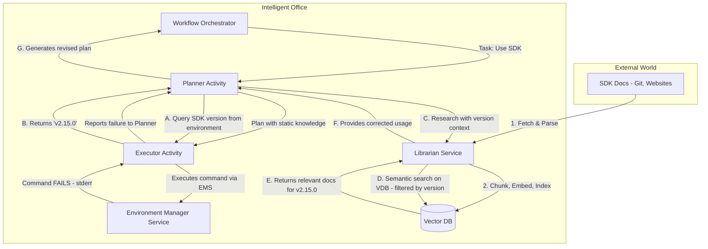
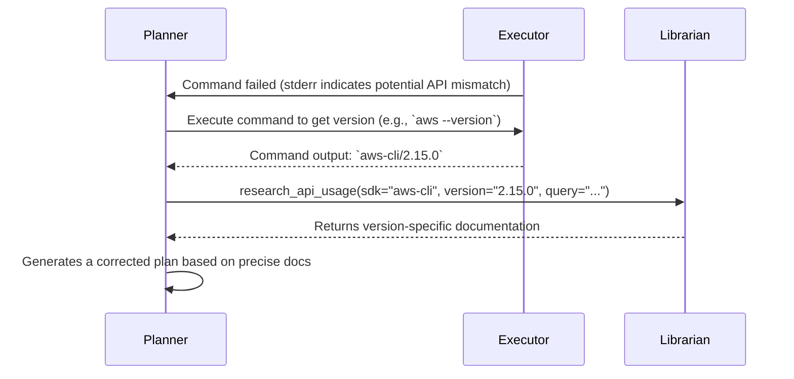

### **Part 4: The Dynamic Knowledge & Adaptation Layer**

This document incorporates reviewer feedback to enhance the design of the "Librarian" service and the self-correcting workflow. The core "Fail → Research → Adapt" loop is strengthened with proactive version detection, smarter triggers, and greater resilience.

### 1. The "Librarian" Service (Enhanced)

The Librarian service remains the central knowledge repository, but its design is updated for production-grade reliability and precision.

#### 1.1. High-Level Architecture with Version Awareness

The architecture now explicitly includes a version detection flow, ensuring that research queries are as specific as possible.



#### 1.2. Enhanced Ingestion Pipeline and Data Model

To improve the quality and relevance of research, the Librarian's data model is enriched:

*   **Richer Metadata**: Each chunk in the Vector DB will be indexed with:
    *   `sdk_name`, `sdk_version`
    *   `entity_name` (e.g., function or class name)
    *   `source_url`
    *   **`last_fetched_at`**: Timestamp for when the source was last pulled.
    *   **`embedding_model_version`**: The version of the embedding model used, to track and manage embedding drift over time.
    *   **`failure_context` (Future)**: Store anonymized `stderr` and `command` snippets from real failures to create a feedback loop, enabling the system to learn which documents resolve specific errors.
*   **Source Freshness**: During retrieval, the Librarian can prioritize documents with a more recent `last_fetched_at` timestamp if conflicting information exists across versions.
*   **Security & Reproducibility**: The Librarian's external web scrapers will run in a sandboxed environment with rate limiting. For critical SDKs, it will prioritize fetching from mirrored Git repositories to ensure stability and reproducibility.

### 2. The Planner's "Research Assistant" Tool (Enhanced)

The `research_api_usage` tool remains the primary interface, now with a more robust output schema.

*   **`research_api_usage`**
    *   **Description**: Queries the internal knowledge base for up-to-date documentation on how to use a specific SDK, CLI tool, or API. It is triggered by specific failure patterns or when the Planner lacks confidence.
    *   **Inputs Schema**: `{"sdk_name": str, "query": str, "version": "Optional[str]"}`
    *   **Output Schema (Enhanced)**:
        ```json
        {
          "error": false,
          "summary": "An LLM-generated summary of the best approach...",
          "confidence_score": 0.95, // Planner's confidence in this summary
          "snippets": [
            {
              "content": "Relevant documentation chunk.",
              "source_url": "URL to the original documentation.",
              "sdk_version": "2.15.0",
              "score": 0.92 // Retrieval relevance score
            }
          ],
          "fallback_suggestions": [ // Populated if confidence is low or no docs are found
              "Try query with version='latest'",
              "Verify the 'sdk_name' is correct",
              "Escalate to human for manual documentation review"
          ]
        }
        ```

### 3. The Enhanced Self-Correcting Workflow: A Deeper Look

The "Fail → Research → Adapt" loop is now more intelligent, proactive, and efficient.

#### 3.1. Intelligent Research Triggers

The decision to call `research_api_usage` is no longer a simple failure check. The Reviewer/Orchestrator uses a rule-based system to identify correctable errors:
```json
// Example trigger logic
{
  "trigger_conditions": [
    "exit_code != 0 AND (stderr contains 'unknown option' OR stderr contains 'invalid argument')",
    "stderr contains 'is deprecated' OR stderr contains 'will be removed'",
    "exit_code == 127 OR stderr contains 'command not found' (suggests tool might be renamed)"
  ]
}
```

#### 3.2. Proactive Version Detection

This is the most critical enhancement. Instead of guessing the version, the Planner actively verifies it.



#### 3.3. Session-Level Caching for Efficiency

To prevent redundant research calls within a single, complex task, the Orchestrator maintains a session-level cache in its workflow state.

```json
// Example workflow scratchpad
{
  "task_id": "xyz-123",
  "learned_this_session": {
    "aws_s3_upload_with_tags_v2.15.0": {
      "correct_command": "aws s3api put-object --tagging ...",
      "researched_at": "2025-10-11T10:30:00Z"
    }
  }
}
```
Before calling the Librarian, the Planner first checks this local cache for a solution.

#### 3.4. Graceful Fallbacks

If the Librarian returns no useful results (or has a low confidence score), the system doesn't crash. The Planner uses the `fallback_suggestions` to attempt recovery:
1.  **Retry Research**: Re-run `research_api_usage` with a broader query (e.g., `version='latest'` or a simplified query).
2.  **Request Clarification**: If ambiguity exists, the system can pause and ask the user for more information.
3.  **Escalate to Human**: As a final resort, the task is flagged for human review with a detailed context report, including the failed commands and the fruitless research attempts.

### 4. Final Verdict

This revised design, incorporating the reviewers' excellent feedback, is solid and directly solves the problem of API and SDK drift. The key innovations are now more robust:

1.  ✅ **Dynamic, Version-Aware Learning**: The AI can research the *correct version* of documentation at runtime.
2.  ✅ **Intelligent Self-Correction Loop**: The system uses specific error patterns to trigger research, avoiding guesswork.
3.  ✅ **Efficient & Resilient**: Session-level caching prevents redundant work, and clear fallback strategies handle cases where documentation is unavailable.
4.  ✅ **Future-Proof Data Model**: The metadata schema is designed to track data freshness and eventually learn from failure patterns.

The "Fail → **Detect Version** → Research → Adapt" workflow is the critical innovation that transforms a brittle, static agent into a resilient, learning system that mirrors how expert human developers work when encountering unfamiliar or changed APIs.