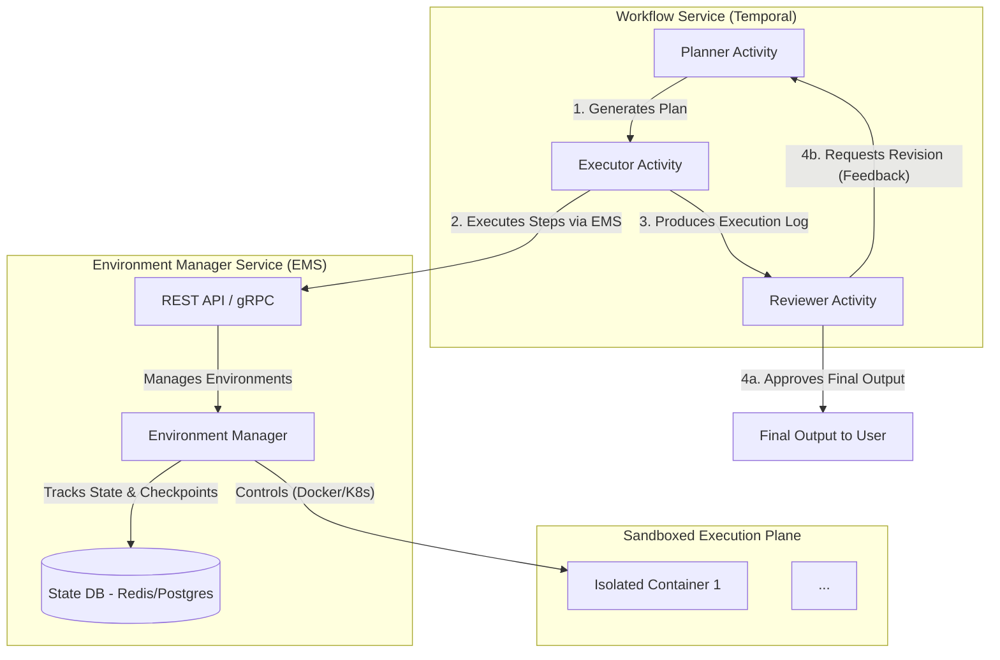

# Part 4: Tools Design (Revised & Enhanced)

## Production-Level Design: The AI Virtual Developer Environment

### 1. Executive Summary

To enable an AI agent to perform complex, multi-step tasks like a human developer, we are moving away from a collection of limited, stateless tools. The new core principle is to provide the AI with a **stateful, interactive, and secure virtual environment** for each task. Instead of calling specific tools like `list_files`, the AI will interact with a persistent session within an isolated environment, primarily using a powerful `execute_command` meta-tool. This approach is managed by a new, central **Environment Manager Service (EMS)**.

### 2. Design Philosophy: Why This Matters

This architecture is founded on a philosophy of emulating a real developer's workflow to unlock higher-level AI capabilities.

*   **Mimics Expert Workflow**: The `Plan -> Act -> Test -> Iterate` loop within a persistent environment mirrors how human developers solve problems.
*   **Enables Long-Horizon Reasoning**: Stateful context retention is critical. The AI can create a file in step 1, test it in step 5, and debug it in step 7 without losing state, which is impossible with stateless tools.
*   **Drives Measurable Autonomy**: Success is not just task completion, but the ability to recover from errors, adapt plans, and operate with less human intervention. This stateful model provides the foundation for such autonomy.

### 3. High-Level Architecture

The system is composed of the **Workflow Service** (orchestrator), the new **Environment Manager Service (EMS)**, and the **Sandboxed Execution Plane**. The architecture is designed for resilience, incorporating patterns like state checkpointing and circuit breakers between services.

### 4. Component Deep Dive

#### 4.1. Environment Manager Service (EMS)

This new microservice is the heart of the execution plane, responsible for the complete lifecycle and secure interaction with the sandboxed environments.

**Responsibilities:**

*   **Lifecycle Management**:
    *   `POST /environments`: Creates a new environment from a template (e.g., 'python-dev', 'node-dev'). Returns `environment_id`.
    *   `DELETE /environments/{id}`: Destroys the environment and all associated resources.
    *   `POST /environments/{id}/heartbeat`: Extends the environment's lifespan.
*   **State Management & Recovery**:
    *   `POST /environments/{id}/snapshot`: Creates a point-in-time snapshot of the `/workspace` volume.
    *   `POST /environments/{id}/rollback`: Restores the workspace from the latest snapshot.
*   **Interaction & Observability API**:
    *   `POST /environments/{id}/execute`: Executes a shell command.
    *   `POST /environments/{id}/files/write`: Writes content to a file.
    *   `GET /environments/{id}/files/read`: Reads content from a file.
    *   `GET /environments/{id}/debug_state`: Returns comprehensive environment info (packages, processes, disk usage).
*   **Security & Resource Management**:
    *   Applies **dynamic resource limits** (CPU, memory, disk space) based on the task profile.
    *   Enforces network policies and manages a **secure secret injection** mechanism.
    *   Manages a queue for concurrent environment requests to prevent overload.

#### 4.2. The Sandboxed Environment

Each environment is a dedicated, short-lived Docker container.

*   **Isolation**: Full process, filesystem, and network isolation.
*   **Base Image**: Created from pre-built templates (e.g., `python-dev:3.10`) with a common toolchain (`git`, `python`, `pip`, etc.) to reduce setup time.
*   **Stateful Workspace**: A unique, dedicated volume at `/workspace` persists for the task's duration.
*   **Ephemeral Nature**: The container and its volume are destroyed by the EMS upon task completion, timeout, or failure.
*   **Unprivileged**: Runs as a non-root user (`appuser`) without privileged access.

#### 4.3. The Workflow Service (Updated Roles)

*   **Planner Activity**: Generates sophisticated, script-like plans using the powerful meta-tools. Can now incorporate error-handling steps like taking snapshots or checking environment health.
*   **Executor Activity**: The primary client for the EMS. Implements retry logic with exponential backoff for transient EMS API failures. It orchestrates API calls and compiles the detailed execution log.
*   **Reviewer Activity**: Inspects the final output and the execution log for errors (`exit_code != 0`), providing detailed feedback for revisions.

### 5. The Planner's Meta-Tools

The Planner's tool catalog is simplified for power and flexibility.

#### 5.1. Core Meta-Tools

*   **`environment.execute_command`**
    *   **Description**: Executes any shell command within the secure, stateful environment. This is the primary tool for all actions.
    *   **Inputs Schema**: `{"command": "The full shell command.", "timeout_seconds": 60}`
    *   **Output**: `{'error': bool, 'stdout': str, 'stderr': str, 'exit_code': int}`
*   **`environment.write_file`**
    *   **Description**: Creates or overwrites a file with the provided content.
    *   **Inputs Schema**: `{"path": "Relative path within the workspace.", "content": "The full file content."}`
    *   **Output**: `{'error': bool, 'message': 'Success or error message.'}`
*   **`environment.read_file`**
    *   **Description**: Reads the entire content of a file from the workspace.
    *   **Inputs Schema**: `{"path": "The relative path of the file to read."}`
    *   **Output**: `{'error': bool, 'content': 'File content or error message.'}`

#### 5.2. Extended & Specialized Meta-Tools

These provide safer, more abstract ways to perform common, complex operations.

*   **`environment.install_dependencies`**
    *   **Description**: Intelligently and safely installs dependencies based on manifest files (`requirements.txt`, `package.json`). Uses an internal allowlist to prevent malicious package installation.
    *   **Inputs Schema**: `{"auto_detect": true}`
    *   **Output**: `{'error': bool, 'stdout': 'Log of installation process.'}`
*   **`environment.execute_script`**
    *   **Description**: Executes a multi-line script with a specified interpreter, handling temporary file creation and cleanup automatically.
    *   **Inputs Schema**: `{"script": "Multi-line script content.", "interpreter": "bash|python|node"}`
    *   **Output**: `{'error': bool, 'stdout': str, 'stderr': str, 'exit_code': int}`
*   **`environment.snapshot_state`**
    *   **Description**: Creates a named snapshot of the current workspace. The Planner should use this before attempting risky operations.
    *   **Inputs Schema**: `{"snapshot_name": "A descriptive name for the checkpoint."}`
    *   **Output**: `{'error': bool, 'message': 'Snapshot created successfully.'}`

### 6. Revised Workflow Logic

1.  **Provision**: The Executor calls the EMS (`POST /environments`) to create a new environment, possibly from a specific template. The `environment_id` is stored in the workflow state.
2.  **Plan**: The Planner generates a sequence of steps. *Example: `snapshot_state`, then `execute_command` to apply changes, then `execute_script` to run tests.*
3.  **Execute**: The Executor iterates the plan, calling the EMS API for each step and compiling results into a structured log with correlation IDs.
4.  **Review**: The log is passed to the Reviewer. It checks for non-zero exit codes and verifies if the final output satisfies the request.
5.  **Decide & Loop**:
    *   **Approved**: The workflow proceeds to the final step.
    *   **Revise**: The Reviewer's feedback, the execution log, and the last known good snapshot ID are passed back to the Planner for the next iteration. The Executor can then roll back the environment if needed.
6.  **De-provision**: A `finally` block in the workflow logic guarantees a final activity is called to destroy the environment (`DELETE /environments/{id}`), ensuring no resources are leaked.

### 7. Security: A Defense-in-Depth Model

Full shell access necessitates a multi-layered security model managed centrally by the EMS.

1.  **Strict Isolation**: Containerization is the baseline. Kernel-level isolation (gVisor) is an option for high-risk tasks.
2.  **Network Policies**: Environments use network profiles: **`offline`** (default), **`read-only-internet`**, or **`full-internet`**, with no access to the internal network.
3.  **Resource Limits**: Strict and dynamic CPU, memory, and disk space limits are enforced.
4.  **Ephemeral and Immutable**: Environments are disposable and created from a read-only base image.
5.  **Least Privilege**: Containers run as a non-root user. Read-only mounts are used for accessing existing codebases.
6.  **Secure Secret Management**: The EMS injects secrets (e.g., API keys) as temporary environment variables from a secure vault, never exposing them in command history or logs.
7.  **Command Auditing & Sanitization**: All commands are logged. A validation layer can block high-risk commands (e.g., `sudo`) before execution.

### 8. Production-Grade Enhancements

*   **Resilience & Recovery**:
    *   **Checkpointing**: The EMS supports workspace snapshotting, enabling the workflow to roll back to a known good state.
    *   **Circuit Breaker**: A circuit breaker between the Workflow Service and EMS prevents cascading failures.
*   **Observability & Debugging**:
    *   **Structured Logging**: All logs are JSON-formatted with correlation IDs linking the workflow, EMS, and container logs.
    *   **Key Metrics**: The EMS will track and expose metrics for creation times, command duration, error rates, and resource utilization for monitoring and alerting.
*   **Scalability & Performance**:
    *   **Container Pooling**: The EMS maintains a pool of pre-warmed base containers to minimize cold-start latency.
    *   **Queuing System**: A priority queue manages concurrent environment requests, ensuring graceful performance under load.

### 9. Developer Experience & Testing

*   **EMS CLI**: A command-line interface (`ems-cli`) will be developed for developers to manually create, inspect, and interact with environments for easier debugging and tool development.
*   **Testing Strategy**:
    *   **Integration Suite**: Automated tests exercising the full `Plan -> Execute -> Review` loop.
    *   **Chaos Engineering**: Randomly inject failures (e.g., container crashes, network drops) to test system resilience.
    *   **Security Testing**: Regular penetration testing of the sandboxed environments.