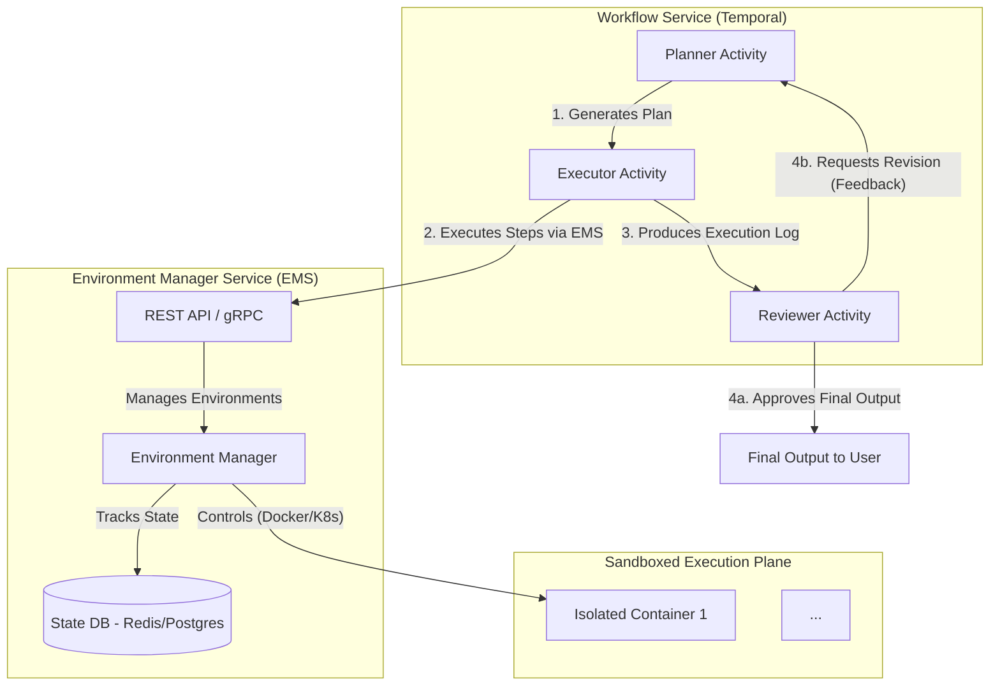

# Part 4: Tools Design

## Production-Level Design: The AI Virtual Developer Environment

### 1. Executive Summary & Core Principle

To enable an AI agent to perform complex, multi-step tasks like a human developer, we are moving away from a collection of limited, stateless tools. The new core principle is to provide the AI with a **stateful, interactive, and secure virtual environment** for each task.

Instead of calling specific tools like `list_files` or `run_python_script`, the AI will interact with a persistent session within an isolated environment, primarily using a powerful `execute_command` meta-tool. This allows it to clone repositories, create and edit files, install dependencies, and run code in sequence, with the state from one step being available to the next. This approach is managed by a new, central **Environment Manager Service (EMS)**.

### 2. High-Level Architecture

The system is composed of three main parts: the existing **Workflow Service** (which orchestrates the process), the new **Environment Manager Service** (which handles the execution environments), and the **Sandboxed Execution Plane** where the work actually happens. The `Plan -> Execute -> Review` loop remains central to ensuring quality and correctness.

### 3. Component Deep Dive

#### 3.1. Environment Manager Service (EMS)

This new microservice is the heart of the execution plane. It is responsible for the complete lifecycle and secure interaction with the sandboxed environments.

**Responsibilities:**

*   **Lifecycle Management**:
    *   `POST /environments`: Creates a new, clean Docker container environment for a task. Returns a unique `environment_id`.
    *   `DELETE /environments/{environment_id}`: Destroys the environment and cleans up all associated resources (container, volumes).
    *   `POST /environments/{environment_id}/heartbeat`: Extends the environment's lifespan, preventing cleanup of active sessions.
*   **Interaction API**:
    *   `POST /environments/{environment_id}/execute`: Executes a shell command within the container.
    *   `POST /environments/{environment_id}/files/write`: Writes content to a file.
    *   `GET /environments/{environment_id}/files/read`: Reads content from a file.
*   **Security & Resource Management**:
    *   Applies strict resource limits (CPU, memory, execution time) to every container.
    *   Enforces network policies (e.g., allow public internet, block internal network).
    *   Manages ephemeral state and automatic cleanup of inactive environments.

#### 3.2. The Sandboxed Environment

Each environment is a dedicated, short-lived Docker container with the following characteristics:

*   **Isolation**: Full process, filesystem, and network isolation via containerization.
*   **Base Image**: A standard image (e.g., from `ubuntu:22.04`) pre-loaded with a common developer toolchain (`git`, `python3`, `pip`, `node`, `npm`, `build-essential`, `tree`).
*   **Stateful Workspace**: Each container mounts a unique, dedicated volume at `/workspace`. This directory is the AI's working area and persists for the duration of the task, allowing state to be carried between steps.
*   **Ephemeral Nature**: The entire container and its workspace volume are destroyed by the EMS upon task completion or timeout. No state persists between different workflow runs.
*   **Unprivileged**: Containers are always run as a non-root user (`appuser`) without privileged access.

#### 3.3. The Workflow Service (Updated Roles)

*   **Planner Activity**: Its role is elevated. Instead of choosing from many simple tools, it now creates sophisticated, script-like plans using a few powerful "meta-tools" to interact with its environment.
*   **Executor Activity**: Acts as the client for the EMS. It receives the plan and orchestrates the API calls to create the environment and execute each step. It is responsible for compiling the detailed execution log.
*   **Reviewer Activity**: Its role is more critical than ever. It validates the final output produced by the AI's complex sequence of operations against the original request. It inspects the execution log for errors (`exit_code != 0`) and provides detailed feedback to the Planner for revisions.

### 4. The New "Meta-Tools" for the Planner AI

The Planner's tool catalog is simplified and made vastly more powerful. These are the primary tools it will use.

---

**Tool: `environment.execute_command`**
*   **Description**: Executes any shell command within the secure, stateful environment. This is the primary tool for all actions like listing files, running scripts, using git, etc. Maintains a persistent working directory and state for the lifetime of the environment.
*   **Inputs Schema**: `{"command": "The full shell command to execute.", "timeout_seconds": 60}`
*   **Output Description**: Returns `{'error': bool, 'stdout': str, 'stderr': str, 'exit_code': int}`. `error` is true if the exit code is not 0.

**Tool: `environment.write_file`**
*   **Description**: Creates or overwrites a file with the provided content. Useful for creating Python scripts, shell scripts, or configuration files that will be executed later.
*   **Inputs Schema**: `{"path": "The relative path within the workspace (e.g., 'src/main.py').", "content": "The full content of the file."}`
*   **Output Description**: Returns `{'error': bool, 'message': 'File saved successfully.' or 'Error message'}`.

**Tool: `environment.read_file`**
*   **Description**: Reads the entire content of a file from the workspace. Use this to inspect code, view logs, or get the output of a script that writes to a file.
*   **Inputs Schema**: `{"path": "The relative path of the file to read."}`
*   **Output Description**: Returns `{'error': bool, 'content': 'The file content' or 'Error message'}`.

---
### 5. Revised Workflow Logic

A task is now processed as a "session" within a dedicated environment.

1.  **Provision (Start of Workflow)**: The Executor calls the EMS (`POST /environments`) to create a new, clean sandboxed environment. The returned `environment_id` is stored in the workflow's state.
2.  **Plan**: The Planner generates a sequence of steps using the meta-tools.
    *   *Example Plan*:
        1.  `execute_command(command="git clone <repo_url>")`
        2.  `write_file(path="<repo>/new_script.py", content="...")`
        3.  `execute_command(command="pip install pandas")`
        4.  `execute_command(command="python <repo>/new_script.py")`
3.  **Execute**: The Executor iterates through the plan, calling the EMS API for each step (e.g., `POST /environments/{id}/execute`) and compiling the results into a log.
4.  **Review**: The complete execution log is passed to the Reviewer. The Reviewer checks for non-zero exit codes and verifies if the final output (e.g., the `stdout` of the last command) satisfies the user's request.
5.  **Decide & Loop**:
    *   If **Approved**, the workflow proceeds to the final step.
    *   If **Revise**, the Reviewer's feedback and the execution log are passed back to the Planner for the next iteration.
6.  **De-provision (End of Workflow)**: A `finally` block in the workflow logic ensures that a final activity is called to instruct the EMS to destroy the environment (`DELETE /environments/{id}`), guaranteeing no resources are leaked.

### 6. Security: A Paramount Concern

Granting full shell access necessitates a defense-in-depth security model managed by the EMS.

1.  **Strict Isolation**: Containerization (Docker) is the baseline. For higher security needs, kernel-level isolation with gVisor or microVMs can be used.
2.  **Network Policies**: Environments have no access to the internal corporate network. Egress to the public internet can be enabled or disabled per task.
3.  **Resource Limits**: Strict CPU, memory, and execution time limits are enforced on every environment to prevent resource exhaustion and DoS attacks.
4.  **Ephemeral and Immutable**: Environments are disposable and created from a read-only base image. Only the `/workspace` volume is writable. All state is destroyed after the task.
5.  **Least Privilege**: Containers run as a non-root user without any special privileges.
6.  **Audit Logging**: Every command executed in every environment is centrally logged for security analysis and traceability.