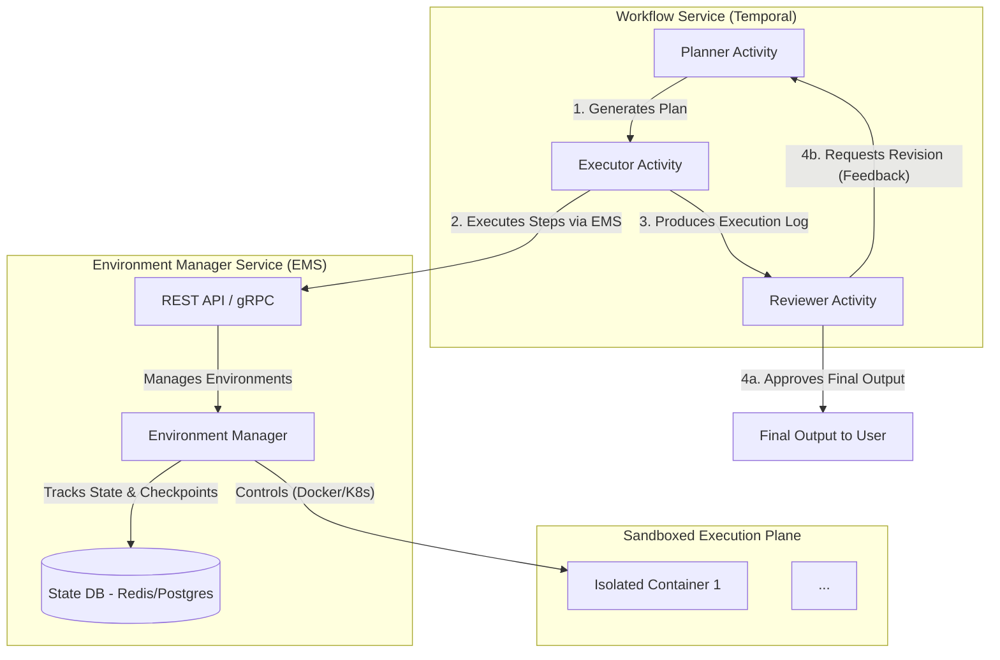
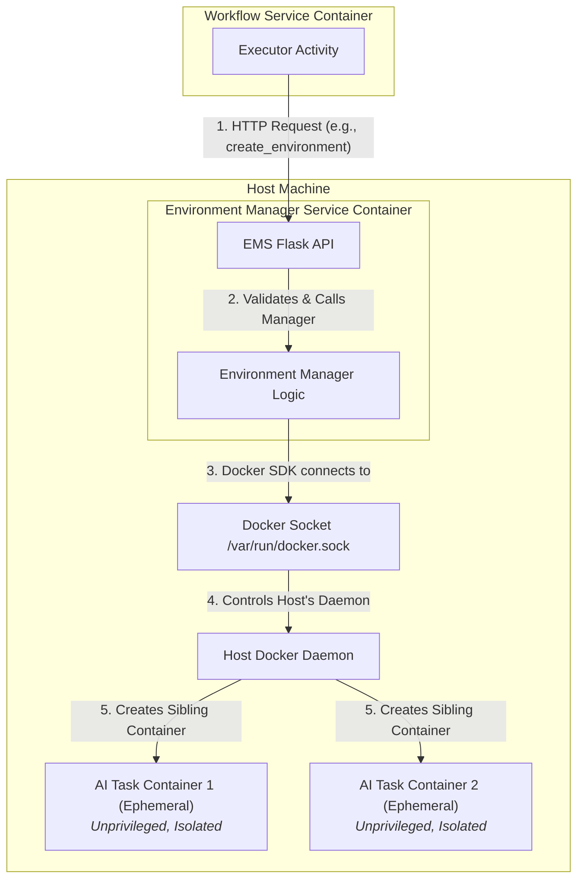

# Part 4: Tools Design (Revised & Enhanced)

## Production-Level Design: The AI Virtual Developer Environment

### 1. Executive Summary

To enable an AI agent to perform complex, multi-step tasks like a human developer, we are moving away from a collection of limited, stateless tools. The new core principle is to provide the AI with a **stateful, interactive, and secure virtual environment** for each task. Instead of calling specific tools like `list_files`, the AI will interact with a persistent session within an isolated environment, primarily using a powerful `execute_command` meta-tool. This approach is managed by a new, central **Environment Manager Service (EMS)**.

### 2. Design Philosophy: Why This Matters

This architecture is founded on a philosophy of emulating a real developer's workflow to unlock higher-level AI capabilities.

*   **Mimics Expert Workflow**: The `Plan -> Act -> Test -> Iterate` loop within a persistent environment mirrors how human developers solve problems.
*   **Enables Long-Horizon Reasoning**: Stateful context retention is critical. The AI can create a file in step 1, test it in step 5, and debug it in step 7 without losing state, which is impossible with stateless tools.
*   **Drives Measurable Autonomy**: Success is not just task completion, but the ability to recover from errors, adapt plans, and operate with less human intervention. This stateful model provides the foundation for such autonomy.

### 3. High-Level Architecture

The system is composed of the **Workflow Service** (orchestrator), the new **Environment Manager Service (EMS)**, and the **Sandboxed Execution Plane**. The architecture is designed for resilience, incorporating patterns like state checkpointing and circuit breakers between services.

#### 3.1. The Control Plane Pattern (Docker Management)

A core security challenge is enabling a containerized service (the EMS) to manage other containers without compromising the host system. This design explicitly avoids insecure patterns like "Docker-in-Docker" (DinD). Instead, it implements a secure **Control Plane** pattern.

The EMS acts as a trusted intermediary. It is the only component with access to the host's Docker socket. All requests to create, execute, or destroy environments are funneled through its secure API. The EMS then instructs the host's Docker daemon to create **sibling containers**, which are fully isolated, unprivileged, and have no access to the Docker socket themselves. This API boundary ensures that AI-executed code remains sandboxed and cannot escalate privileges to manage the host.

### 4. Component Deep Dive

#### 4.1. Environment Manager Service (EMS)

This new microservice is the heart of the execution plane, responsible for the complete lifecycle and secure interaction with the sandboxed environments.

**Responsibilities:**

*   **Lifecycle Management**:
    *   `create_environment`: Provisions a new environment, optionally cloning a Git repository to a specified branch. Returns `environment_id`.
    *   `destroy_environment`: Decommissions an environment, returning it to a warm pool or destroying it entirely.
*   **Interaction & Execution**:
    *   `execute_command`: Executes a shell command within a specified environment.
    *   `write_file` / `read_file`: Manages file I/O within the environment's workspace.
*   **Security & Resource Management**:
    *   Applies static resource limits (CPU, memory) to all sandboxed containers.
    *   Enforces network policies, providing internet access for essential tasks like `git clone`.
    *   Manages a secure credential injection mechanism for private Git repositories.

#### 4.2. The Sandboxed Environment

Each environment is a dedicated, short-lived Docker container.

*   **Isolation**: Full process, filesystem, and network isolation from the host and other containers.
*   **Base Image**: Created from a pre-built `ai-dev-base` image with a common toolchain (`git`, `curl`, `tree`, etc.) to reduce setup time.
*   **Stateful Workspace**: A unique, dedicated Docker volume is mounted at `/workspace` for the task's duration.
*   **Ephemeral Nature**: The container and its volume are destroyed by the EMS upon task completion, timeout, or failure, ensuring no state leakage.
*   **Unprivileged**: Runs as a non-root user (`appuser`) without privileged access.

#### 4.3. The Workflow Service (Updated Roles)

*   **Planner Activity**: Generates sophisticated, script-like plans. It can now specify a `repo_url` and `branch` when creating an environment.
*   **Executor Activity**: The primary client for the EMS. It orchestrates the API calls defined in the plan and compiles the detailed execution log.
*   **Reviewer Activity**: Inspects the final output and the execution log for errors (`exit_code != 0`), providing detailed feedback for revisions.

### 5. The Planner's Meta-Tools

The Planner's tool catalog is simplified for power and flexibility, centered around environment lifecycle and command execution.

#### 5.1. Core Meta-Tools

*   **`create_environment`**
    *   **Description**: Provisions a new, isolated, stateful development environment. This MUST be the first step in any plan. Optionally initializes the workspace by cloning a Git repository and checking out a specific branch.
    *   **Inputs Schema**: `{"repo_url": "Optional Git repository URL.", "branch": "Optional Git branch, defaults to 'develop'."}`
    *   **Output**: `{'error': bool, 'environment_id': str, 'volume_id': str}`

*   **`execute_command`**
    *   **Description**: Executes any shell command within the secure, stateful environment. This is the primary tool for all actions.
    *   **Inputs Schema**: `{"environment_id": str, "command": "The full shell command.", "timeout_seconds": 60}`
    *   **Output**: `{'error': bool, 'stdout': str, 'stderr': str, 'exit_code': int}`

*   **`write_file`**
    *   **Description**: Creates or overwrites a file with the provided content.
    *   **Inputs Schema**: `{"environment_id": str, "path": "Relative path within the workspace.", "content": "The full file content."}`
    *   **Output**: `{'error': bool, 'stdout': 'Success or error message.'}`

*   **`read_file`**
    *   **Description**: Reads the entire content of a file from the workspace.
    *   **Inputs Schema**: `{"environment_id": str, "path": "The relative path of the file to read."}`
    *   **Output**: `{'error': bool, 'content': 'File content or error message.'}`

*   **`destroy_environment`**
    *   **Description**: Decommissions and cleans up an environment. This MUST be the final step in any plan to prevent resource leaks.
    *   **Inputs Schema**: `{"environment_id": "The ID of the environment to destroy."}`
    *   **Output**: `{'error': bool, 'stdout': 'A confirmation message.'}`

### 6. Revised Workflow Logic

1.  **Provision**: The Executor calls `create_environment` via the EMS, optionally passing a `repo_url` and `branch`. The `environment_id` is stored in the workflow state.
2.  **Plan**: The Planner generates a sequence of steps using `execute_command` and other tools.
3.  **Execute**: The Executor iterates the plan, calling the EMS API for each step and compiling results into a structured log.
4.  **Review**: The log is passed to the Reviewer. It checks for non-zero exit codes and verifies if the final output satisfies the request.
5.  **Decide & Loop**: The workflow either approves the result or triggers a revision with feedback.
6.  **De-provision**: A `finally` block in the workflow logic guarantees a final call to `destroy_environment`, ensuring no resources are leaked.

### 7. Security: A Defense-in-Depth Model

Full shell access necessitates a multi-layered security model managed centrally by the EMS.

1.  **Strict Isolation**: The Control Plane pattern provides the primary isolation boundary.
2.  **Network Policies**: Environments are connected to the `bridge` network to allow outbound internet access for `git` operations but have no access to the internal service network.
3.  **Resource Limits**: Strict CPU and memory limits are enforced on all sandboxed containers.
4.  **Ephemeral and Immutable**: Environments are disposable and created from a read-only base image.
5.  **Least Privilege**: Containers run as a non-root user.
6.  **Secure Secret Management**: The EMS injects a Git PAT from its environment variables into the `git clone` command, never exposing it in logs or to the AI planner.
7.  **Command Auditing**: All executed commands are logged by the EMS for monitoring and analysis.

### 8. Production-Grade Enhancements

*   **Resilience & Recovery**:
    *   **Smart Updates**: The EMS intelligently updates existing Git repositories in pooled containers (`git fetch` & `reset`) instead of performing a full `clone` every time, dramatically improving performance for repeated tasks on the same repository.
*   **Observability & Debugging**:
    *   **Structured Logging**: All logs are JSON-formatted with correlation IDs linking the workflow, EMS, and container logs.
    *   **Key Metrics**: The EMS will track and expose metrics for creation times, command duration, error rates, and resource utilization for monitoring and alerting.
*   **Scalability & Performance**:
    *   **Container Pooling**: The EMS maintains a pool of pre-warmed, idle containers to minimize cold-start latency for new environment requests.
    *   **Submodule Support**: The environment provisioning process automatically initializes and updates Git submodules, ensuring complex projects are set up correctly.