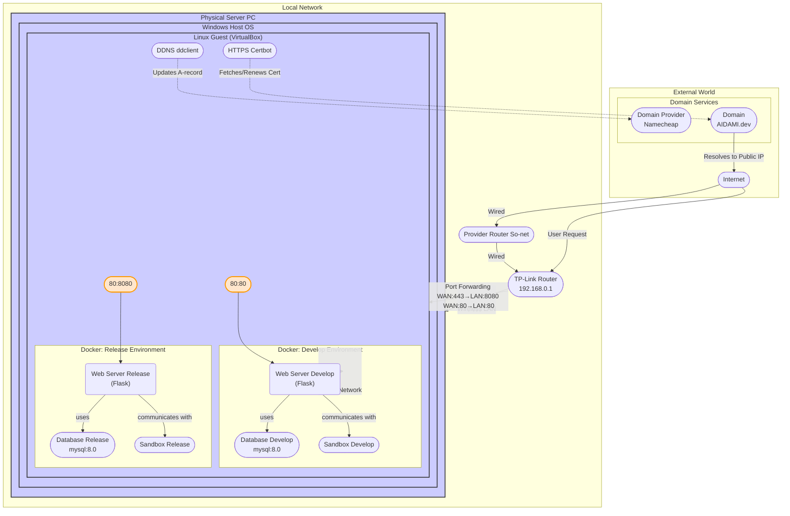

network topology

```mermaid
flowchart TD
    %% External World (Internet & Cloud Services)
    subgraph External ["External World"]
        Internet([Internet])
        subgraph DomainServices ["Domain Services"]
            DomainProvider([Domain Provider<br/>Namecheap])
            Domain([Domain<br/>AIDAMI.dev])
        end
    end
    
    %% Local Network Setup
    subgraph LocalNetwork ["Local Network"]
        ProviderRouter([Provider Router So-net])
        SelfRouter([TP-Link Router<br/>192.168.0.1])
        
        %% Server PC and its virtual layers
        subgraph ServerPC ["Physical Server PC"]
            subgraph WindowsHost ["Windows Host OS"]
                subgraph LinuxGuest ["Linux Guest (VirtualBox)"]
                    DDNS([DDNS ddclient])
                    HTTPS([HTTPS Certbot])
                    
                    %% Port mapping nodes for clarity
                    Port8080(["80:8080"])
                    Port80(["80:80"])

                    subgraph DockerRelease ["Docker: Release Environment"]
                        WebServerRelease("Web Server Release<br/>(Flask)")
                        DatabaseRelease([Database Release<br/>mysql:8.0])
                        SandboxRelease([Sandbox Release])
                    end
                    
                    subgraph DockerDevelop ["Docker: Develop Environment"]
                        WebServerDevelop("Web Server Develop<br/>(Flask)")
                        DatabaseDevelop([Database Develop<br/>mysql:8.0])
                        SandboxDevelop([Sandbox Develop])
                    end
                end
            end
        end
    end
    
    %% --- Define Connections ---
    %% All connections are defined here for maximum compatibility
    
    %% Internet to Local Network
    Internet -- "Wired" --> ProviderRouter
    ProviderRouter -- "Wired" --> SelfRouter
    
    %% Router to Server (Physical and Virtual)
    SelfRouter -- "<br/><br/>Wireless LAN" --> ServerPC 
    WindowsHost -- "<br/><br/><br/><br/>Bridge Network" --> LinuxGuest
    
    %% Incoming Traffic Flow (Domain Resolution & Port Forwarding)
    Domain -- "Resolves to Public IP" --> Internet
    Internet -- "User Request" --> SelfRouter
    SelfRouter -- "Port Forwarding WAN:443→LAN:8080 WAN:80→LAN:80" --> LinuxGuest
    
    %% Linux Guest Port Mapping to Docker Services
    Port8080 --> WebServerRelease
    Port80 --> WebServerDevelop

    
    %% Internal Docker connections
    WebServerRelease -- "uses" --> DatabaseRelease
    WebServerDevelop -- "uses" --> DatabaseDevelop
    WebServerRelease -- "communicates with" --> SandboxRelease
    WebServerDevelop -- "communicates with" --> SandboxDevelop
    
    %% Management/Update Connections (outbound from local network)
    DDNS -.->|"Updates A-record"| DomainProvider
    HTTPS -.->|"Fetches/Renews Cert"| Domain
    
    %% Styling
    classDef darkBlue fill:#ccf,stroke:#333,stroke-width:2px
    classDef portNode fill:#ffe6cc,stroke:#ff9900,stroke-width:2px
    class ServerPC,WindowsHost,LinuxGuest darkBlue
    class Port8080,Port80,Port5001,Port5002,ContainerPort80Release,ContainerPort80Develop portNode
```
